# 1.开发目的

艰苦卓绝的三年新冠疫情抗争接近尾声，2023年随着疫情防控政策逐渐放开，在政府出台的一系列支持或惠及旅游企业的政策措施下，旅游业努力克服多重因素影响，统筹做好疫情防控和恢复发展。四川省有着得天独厚的自然资源、璀璨夺目的文化瑰宝、五彩斑斓的民俗生活，有着"天府之国"美誉的四川省一直以来作为旅游强省吸引八方游客。

旅游业传统的发展模式是"圈山圈水收门票,人山人海吃红利"的流量思维,但在全域旅游战略下,特别是预约、限流新常态下,大客流模式存在全域化、分散化、线上化迁移的可能。旅游业的开放式发展,已在"旅游+"和"+旅游"的融合发展上持续加深,基于文化和旅游融合逐步进入深水区，在线经济和文化融合成为行业进一步创新发展的动力。而旅游行业与地理空间关系紧密，基于GIS系统，使得用户可以根据关键信息进行智能匹配，快速查询目标兴趣区，提高了旅游信息获取的效率。

四川位于民族东西交融、南北过渡的走廊，糅合吸收民族之长，聚居藏、羌、纳西等55个少数民族，拥有独特的地域文化和绚丽的民族风情，丰富的红色文化与古蜀文明交相辉映，相得益彰。但是，目前四川旅游存在住宿选取、景点选取困难的痛点，高海拔地区住宿区距离远，无法准确定位住宿点，大部分景点知名度不高，存在信息查询困难，位置准确度不高等问题；极端天气突发，可视化程度低四川地处碰撞板块，地质灾害频发，加上高原极端天气，危险性高；在线交流困难在出行和计划时期，不能时刻了解景点客流量、住宿、天气情况等信息，同时高海拔信号差，不能准确获取信息判断是否满足出行需求；路线规划复杂山区地势复杂，存在交通拥堵和道路不明等情况，导致不能快速定位景点和住宿位置。

因此，开发一款解决上诉痛点和需求的系统即四川省旅游WebGIS系统，能够提升游客的旅游体验和满意度。通过该系统，游客可以轻松获取准确的住宿和景点信息，了解目标地区的天气和地质情况，实时获取景点客流量和天气情况等信息，规划最佳的旅行路线，并与其他游客和旅游机构进行在线交流和信息分享。

该系统的目标是打破传统旅游发展模式的局限性，适应全域旅游战略和新常态下的需求变化。通过结合文化和旅游的融合发展，以及在线经济的发展，该系统将为四川旅游业带来创新发展的动力。

系统的开发旨在提供用户友好的界面和交互方式，确保用户可以轻松地浏览和查询旅游信息，进行智能匹配和快速定位目标兴趣区。同时，系统将充分考虑四川地区的特点和复杂性，提供可视化的天气和地质信息，解决高海拔地区的住宿和景点选取困难。此外，系统还将整合各类旅游资讯和实用工具，帮助游客获取全面的旅游信息，应对路线规划复杂、在线交流困难等问题。

综上所述，四川省旅游WebGIS系统的开发旨在为游客提供便捷、准确的旅游信息服务，访问便捷，操作简单。可以提供基于四川省景区信息的统计和大数据可视化服务，展示四川省A级景区的分布情况；提供空间查询服务，精确查询并实时展示目标区域内景区和旅行社信息；可以提供空间分析能力，提供最佳自驾路径分析和多景区旅游自驾路径规划服务，操作简单，精准查询并展示目的地A级旅游景区位置和添加多个旅游景区，并可以分析并展示从地图任意地点到目的景区的最佳自驾路径，规划多目的景区旅游最佳自驾路径。满足他们的住宿、景点选择、天气和地质情况查询、路线规划等需求，促进四川旅游业的恢复和发展。

# 2.开发流程

## 2.1 数据处理

搜集四川省旅游景点、居民点和旅行社信息，将地图要素导入，通过地理编码获取坐标，统一坐标系。在桌面端SuperMap
iDesktop构建工作空间，处理表格数据，展点展示各地理数据，搭建网络数据集。

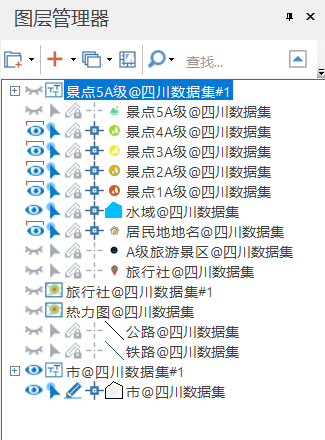{width="2.15625in"
height="2.9611111111111112in"}

图1 网络数据集

通过对各地理要素整饰符号，修改配色和风格，得到以下地图。

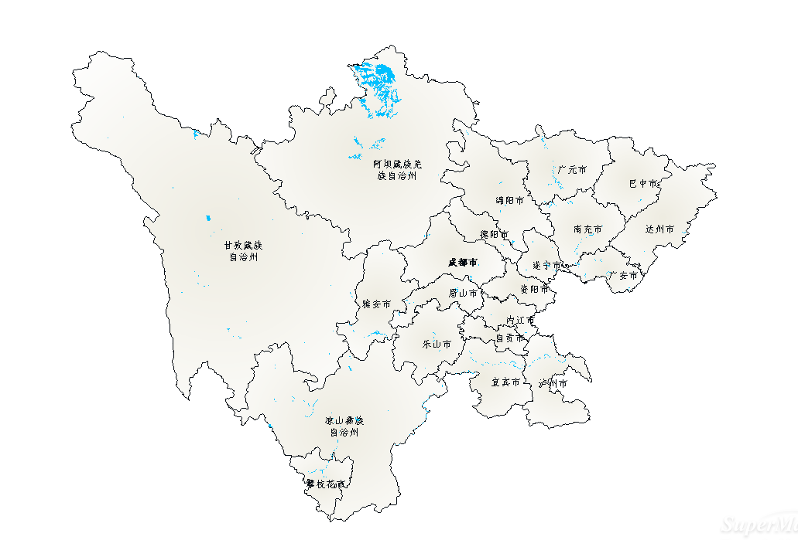{width="5.1in"
height="3.457638888888889in"}

图2 处理后地图

## 2.2 服务发布

将工作空间上传至SuperMap
iServer服务器中，依据配置依次发布REST地图服务、数据服务和网络数据集服务，其中地图服务返回四川省地图，数据服务将工作空间各数据进行发布，供前端查询和编辑；网络数据集服务提供交通网络分析服务。

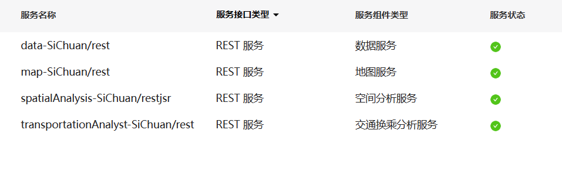{width="5.761805555555555in"
height="1.7881944444444444in"}

图3 服务发布

## 2.3 编程调用

利用SuperMap
iClient构建前端服务查询算法，通过请求iServer发布的数据服务，将符合条件的地理要素展示在地图上。

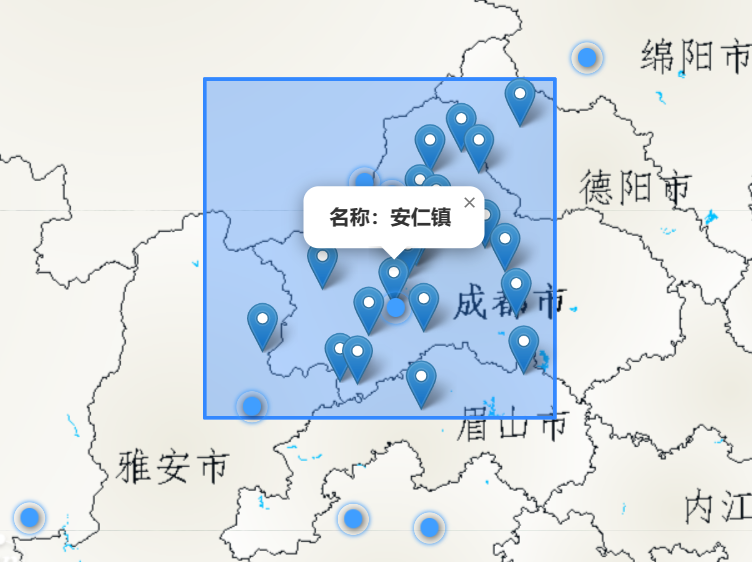{width="3.8381944444444445in"
height="2.8680555555555554in"}

图4 查询结果

## 2.4 后台管理

通过SpringBoot搭建后端框架，以JWT做为权限管理工具，用户无token无法进入地图主页。使用MaBatis
PLUS最终搭建实体层、服务层和数据层的三层稳定架构，低耦合，高内聚，便于后续接口的维护和新增，可维护性强。

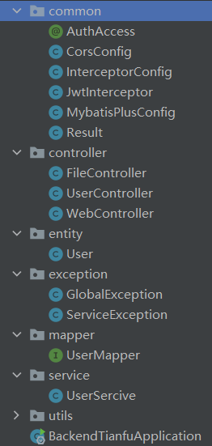{width="1.9555555555555555in"
height="4.113194444444445in"}

图5 后台架构

# 3.技术手段

## 3.1 总体技术路线

本系统使用全系列超图软件，以Vue+SpringBoot构建系统前后端分离框架。

GIS方向首先使用桌面端SuperMap iDesktop处理数据，并利用SuperMap
iServer进行地图信息的服务发布，最后由前端SuperMap iClient调用地图服务。

业务方向使用MySQL和SQL
Server作为数据库，实现数据的持久化；使用SpringBoot和MyBatis
PLUS搭建系统后端接口；前端使用Vue+axios进行前后端数据交互，利用Three.js搭建全景地图；利用Git进行开发协作，并利用Gitee作为代码仓库。

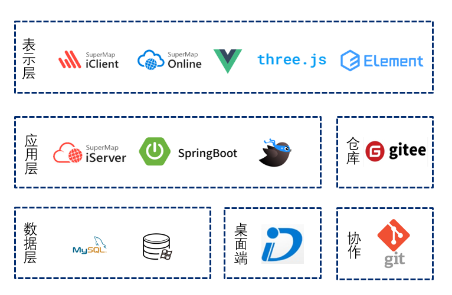{width="4.667361111111111in"
height="3.0520833333333335in"}

图6 技术路线

## 3.2 前端技术

前端采用Vue+ELement-UI作为框架和样式库，利用Axios完成前后端数据交互。地图方面采用了SuperMap
iClient for Leaflet，SuperMap iClient for Mapbox和天地图组件。

## 3.3 后端技术

后端采用SpringBoot作为框架，耦合了MyBatits
PLUS、HuTools、JWT等工具搭建了集成用户注册登录、权限验证、修改密码、更改头像、用户管理等接口。JWT负责权限验证，如果角色为用户则无权管理他人信息；如果访问不存在的页面会出现404页面拦截。

## 3.4 地图服务

使用SuperMap
iServer作为GIS服务器，发布了地图服务、数据服务和网络数据集服务。

## 3.4 数据库

使用MySQL作为业务数据库。

# 4.创新特色

## 4.1 自发布式服务

使用自发布式服务，没有API访问数量限制。

## 4.2 数据大屏

使用数据可视化一览大屏向用户展示四川省各个地区的旅游热点、流量趋势、景点旅行社分布及路线规划。

## 4.3 严密的权限系统

严密的权限系统，用户访问无权限网址和不存在网址时，会被拦截转向安全网址。用户无token无法进入地图主页。

## 4.4 接口高内聚，低耦合

系统接口低内聚高耦合，便于新增和修改，可维护性好。

# 5.功能

## 5.1 系统架构图

四川省旅游资源服务系统基于SOA架构，采用B/S结构进行开发和设计。本系统框架主要分为基础设施层、数据资源层、服务层、应用综合层以及用户层。本系统框架设计示意图如图所示。

系统框架设计说明：

1.  基础设施层主要包括系统运行的软硬件设施，如服务器、存储设备、GIS平台等；

2.  数据资源层为系统应用提供基础地理信息数据和各类旅游信息资源数据，如旅游景点数据、旅游路线、餐饮住宿等；

3.  服务层是按照一定的标准，以服务的方式进行聚合，从而提高系统开发效率，常用的服务有地图服务、查询服务、定位服务等；

4.  应用综合层是用户能够应用的功能，主要包括旅游地理信息浏览、GIS基本操作、景区街景展示、以及景区自驾路线等；

5.  用户层是系统使用人员，主要包括系统管理员、游客等。

{width="4.0375in"
height="3.307638888888889in"}

图 7 系统框架设计

## 5.2 功能划分

基于WebGIS的四川省旅游资源服务系统的结构与功能从总体结构和功能分配方面统一考虑,系统的数据库及软件模块将可以在其它子系统中进行重用，以减少今后系统开发和维护的工作量。

按照功能构成，软件系统可分为七个主要部分：用户管理功能、地图浏览功能、地图可视化功能、地图查询功能、地图分析功能、景区评价功能和拓展功能。其功能结构图如图8所示。

{width="5.768055555555556in"
height="3.720138888888889in"}

具体功能如下：

1.  用户管理功能：用户注册模块、用户登录模块、用户信息修改模块。

2.  地图浏览功能：底图切换模块、浏览操作模块。

3.  地图可视化功能：专题符号模块、Echarts图表模块、热力图模块。

4.  地图查询功能：景点查询模块、旅行社查询模块、缓冲区住宿查询模块。

5.  地图分析功能：最佳自驾路径分析模块、多景区旅游自驾路径分析模块。

6.  景区评价功能：查看和发布评价模块、管理评价模块。

7.  拓展功能：天气功能模块、基于协同过滤算法的景点推荐模块、地质灾害预警模块、VR场景模块。

### 5.2.1 用户管理功能

1.  用户可以注册、登录、修改个人信息；

2.  管理员可以添加、修改、删除用户的信息。

> 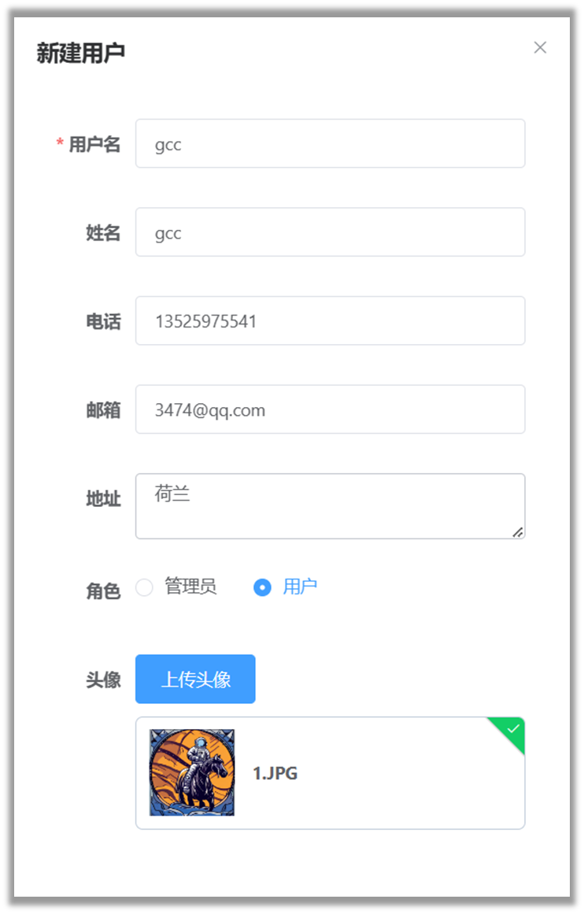{width="2.7291666666666665in"
> height="4.271527777777778in"}
>
> 图9 新建用户

### 5.2.2 地图浏览功能

1.  使用天地图为系统底图,可切换天地图图层类型,实现地图的图层类型切换;

2.  实现地图的基本浏览操作,包括放大、缩小、平移，并在系统加载时，默认显示为四川省的可视范围。

> 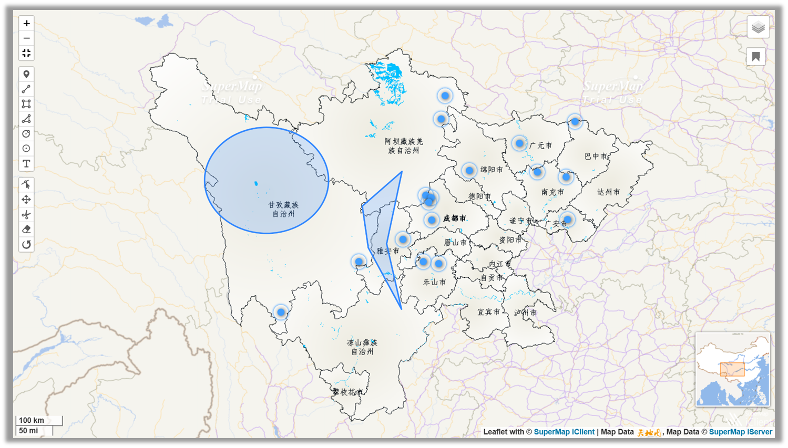{width="5.3493055555555555in"
> height="3.04375in"}
>
> 图10 地图浏览

### 5.2.3 地图可视化功能

1.  对地图符号系统进行分专题设计，对地图中展示四川省A级景区的分布情况;

2.  使用ECharts的丰富图表,在地图中清晰表达四川省各市的5A、4A、3A级旅游景点数量。

3.  提供旅游信息旅游热力图，实现旅游和住宿的大屏可视化。\
    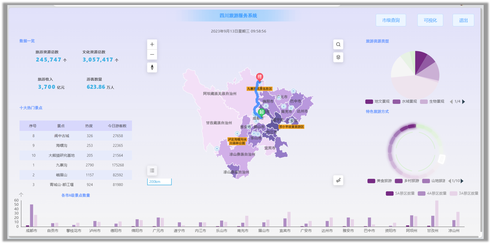{width="5.614583333333333in"
    height="2.7909722222222224in"}

> 图11 数据大屏

### 5.2.4 地图查询功能

1.  在搜索框内输入旅游景区名称，定位该景点位置，点击景区位置展示该旅游景区的属性信息；

2.  在地图上点击市级行政区划，展示该市内的旅行社信息；

> 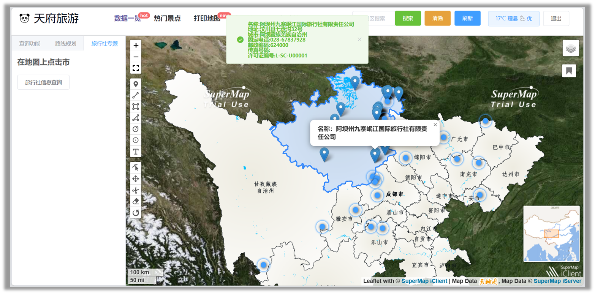{width="5.106944444444444in"
> height="2.5236111111111112in"}
>
> 图12 市级旅行社查询结果

### 5.2.5 地图分析功能

1.  最佳自驾路径：要求可以查询并展示目的地A级旅游景区位置，并可以分析并展示从地图任意地点到目的景区的最佳自驾路径；

最佳路径分析，是求解网络中两点之间阻抗最小的路径，必须按照节点的选择顺序访问网络中的结点。"阻抗最小"有多种理解，如基于单因素考虑的时间最短、费用最低、风景最好、路况最佳、过桥最少、收费站最少、经过乡村最多等。本项目的最佳自驾路径主要考虑时间最短的路径求解，示例图如图所示。

{width="4.675694444444445in"
height="2.1993055555555556in"}

2.  多景区旅游自驾路径规划：查询并添加多个旅游景区，规划多目的景区旅游最佳自驾路径。

多景区旅游自驾路径规划实际上可以归为时间最短情况下，按照结点的选择顺序访问网络中的结点所求求解出的网络中两点之间阻抗最小的路径，示例图如图所示。

{width="5.488194444444445in"
height="2.571527777777778in"}

### 5.2.6 景区评价功能

1.  用户可以查看和发布景区的评论信息,包括注意事项、景区评价等信息；

2.  管理员对不合理的评论信息进行管理，维护正常秩序。

### 5.2.7 拓展功能

1.  **天气功能**

四川省地处中国西南地区，气候多样，天气变化较为频繁，因此在旅游系统中引入一个天气模块是非常有必要的。该模块可以为游客提供准确的天气信息，帮助他们做出合理的行程安排和准备，提升旅游体验和安全性。

和风天气开发服务基于先进的气象和人工智能算法，为广大开发者和企业提供了丰富、精准的天气数据服务，帮助你在应用中展示天气，或助力你的业务决策。这一切都可以通过和风天气提供的开发工具，轻松的集成。天气模块可以集成天气警报和提示功能，当出现恶劣天气条件（如暴雨、雷电、大风等）时，系统可以向用户发送警报或提示信息，提醒他们采取相应的安全措施，确保旅游活动的安全。该模块应允许用户选择具体的地区或景点，以获取该地区的天气信息。天气模块提供天气预报功能，包括未来几天的天气状况、气温、降水概率、风力等信息。这样游客可以提前知道目的地的天气情况，为行程安排和装备选择做出合理的决策，天气效果如图所示。

{width="1.9479166666666667in"
height="0.625in"}

{width="5.759722222222222in"
height="2.7291666666666665in"}

2.  **地质灾害预警**

四川地处地震多发区和复杂地质环境的地区，地质灾害是该地区旅游系统面临的重要风险之一。为了提高旅游系统的安全性和可持续发展，建立一个地质灾害预警模块是非常重要的，四川省历史地震示例图如图所示，来自SuperMap
Online。

{width="5.759722222222222in"
height="2.6777777777777776in"}

3.  **VR场景**

四川省旅游系统中引入VR全景地图模块可以为游客提供沉浸式的旅游体验，使其能够在虚拟环境中亲身感受目的地的美景和文化特色。VR全景地图模块应包括四川省部分旅游目的地的地理覆盖，并展示主要景点的全景照片或视频。这样的模块可以为游客提供更直观、真实的感受，让他们在虚拟环境中仿佛置身于目的地之中，为接下来的旅行做足准备，示例图如图所示：

{width="5.759722222222222in"
height="2.6881944444444446in"}

## 5.3 功能描述与分析

### 5.3.1 用例图

用例图（Use Case
Diagram）是用户与系统交互的最简表示形式，展现了用户和与他相关的用例之间的关系。通过用例图，人们可以获知系统不同种类的用户和用例。用例图下面将和数据流图配合使用，用例图如图所示。

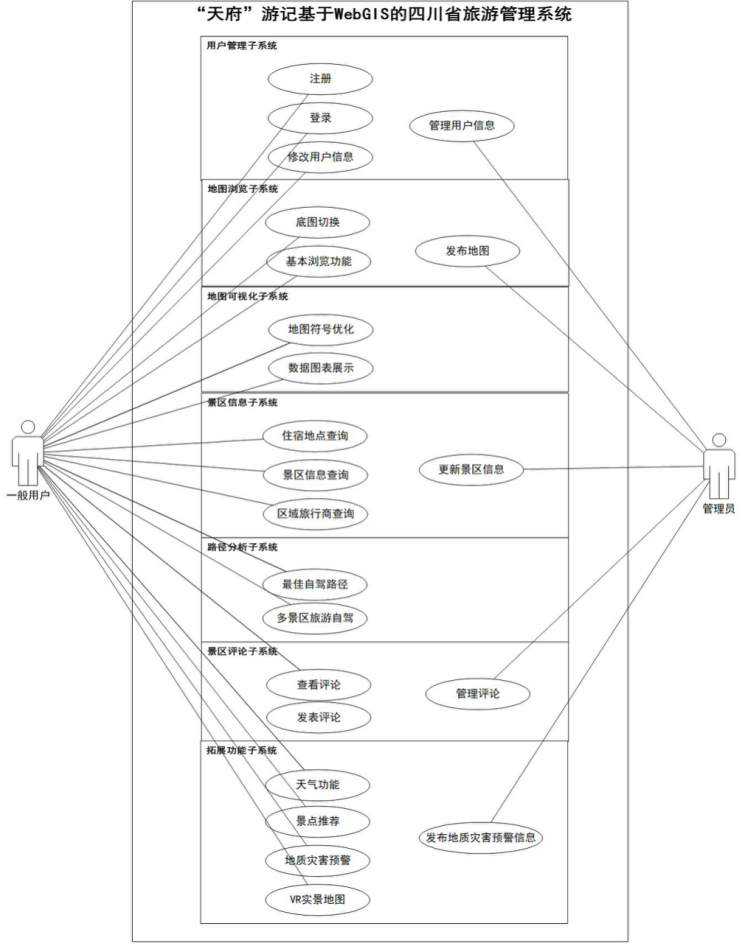{width="4.045833333333333in"
height="5.147916666666666in"}

图 18 用例图

系统包括一般用户（游客）和管理员2个角色，用户管理、地图浏览、地图可视化、景区信息、路径分析、景区评论和拓展功能7个子系统，注册、登录、修改用户信息等23个用例。与管理员关联的用例有管理用户信息、发布地图、更新景区信息、管理评论和发布地质灾害预警信息5个用例，与用户关联的用例有注册、登录、修改用户信息等18个用例。

### 5.3.2 数据流图

数据流图（Data Flow
Diagram）：简称DFD，它从数据传递和加工角度，以图形方式来表达系统的逻辑功能、数据在系统内部的逻辑流向和逻辑变换过程，是结构化系统分析方法的主要表达工具及用于表示软件模型的一种图示方法。数据在系统中流动和处理的过程。下面，我们使用分层的数据流图来详细表述数据在系统中流动和处理的过程。

**顶层数据流图**

用户群体由一般用户和管理员用户组成。不同用户群体使用系统目标不同故相应功能使用权限不同。其中，一般用户可进行用户信息的更新、对地图进行浏览、查询和分析处理以及可视化、景区评价以及一系列拓展功能的操作，管理员用户则是主要进行对用户信息的维护，如图所示。

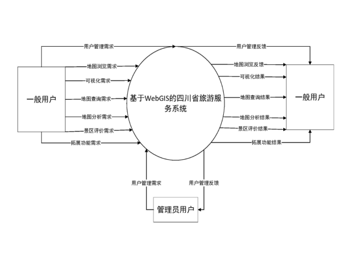{width="5.767361111111111in"
height="4.29375in"}

图 19 顶层数据流图

**第一层数据流图**

整个系统可分为七个子系统：用户管理子系统、地图浏览子系统、可视化子系统、地图查询子系统、地图分析子系统、景区评价子系统和拓展功能子系统。用户管理子系统由管理员用户和一般用户共同使用，但权限不同，管理员用户再登录后可以对所有用户及其操作的信息进行维护和修改，而一般用户在登录后只能修改自己的身份信息而没有查看其他用户身份信息的权限。地图浏览子系统、可视化子系统、地图查询子系统、地图分析子系统、景区评价子系统和拓展功能子系统面向一般用户，地图浏览子系统为一般用户提供地图的基本浏览操作,包括放大、缩小、平移等功能；可视化子系统主要执行数据的区域汇总分析以及图表大屏等数据可视化功能；地图查询可视化子系统主要包括属性查询和空间查询两部分；地图分析子系统主要包括最佳自驾路径规划、多景区旅游自驾路径规划以及查找最近居民点功能。景区评价子系统可以使用户可以查看和发布景区的评论信息；拓展功能子系统主要包括天气查看，基于协同过滤算法的景点推荐、地质灾害预警和VR场景功能，如图所示。

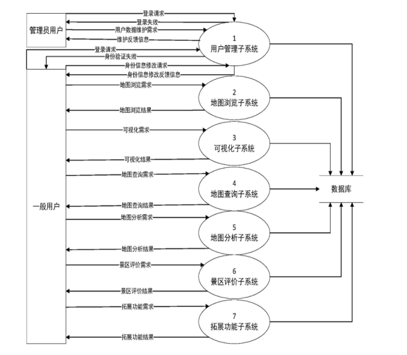{width="5.763194444444444in"
height="5.031944444444444in"}

图 20 第一层数据流图

**第二层数据流图**

当一般用户发出操作请求，需要输入用户ID和密码进行身份验证。验证通过后，就可以进入地图浏览子系统，否则系统将显示身份验证失败，要求用户重新输入验证信息。进入系统后，按自身所需选择底图切换或浏览操作，默认使用天地图为系统底图,可切换天地图图层类型,实现地图的图层类型切换，并在系统加载时，默认显示为四川省的可视范围，以进行下一步的操作，进行和数据库的交互，并将结果反馈给用户，如图所示。

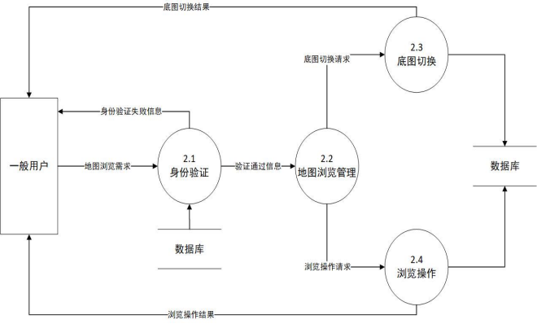{width="5.240277777777778in"
height="3.1597222222222223in"}

图 21 地图浏览子系统

当一般用户发出操作请求，需要输入用户ID和密码进行身份验证。验证通过后，就可以进入可视化子系统，否则系统将显示身份验证失败，要求用户重新输入验证信息。进入系统后，按自身所需选择专题符号展示或图表大屏展示，将专题符号加载到地图中可以直观地展示四川省A级景区的分布情况，此外使用ECharts的丰富图表，并从数据库中读取数据，可以清晰表达四川省各市的5A、4A、3A级旅游景点数量。提供旅游信息热点词云及旅游热力图，经处理后输出给用户，如图所示。

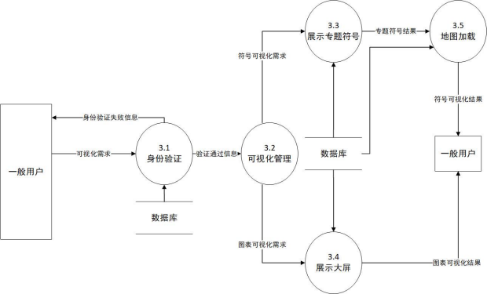{width="5.027083333333334in"
height="3.040277777777778in"}

图 22 可视化子系统

当一般用户发出操作请求，需要输入用户ID和密码进行身份验证。验证通过后，就可以进入地图查询子系统，否则系统将显示身份验证失败，要求用户重新输入验证信息。进入系统后，根据数据库中所存放的数据，按自身所需选择属性查询或空间查询，如图23所示。

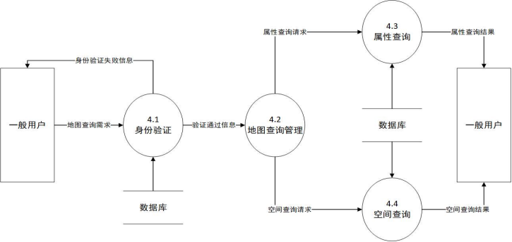{width="5.522916666666666in"
height="2.6194444444444445in"}

图 23 地图查询子系统

当一般用户发出操作请求，需要输入用户ID和密码进行身份验证。验证通过后，就可以进入地图分析子系统，否则系统将显示身份验证失败，要求用户重新输入验证信息。进入系统后，按自身所需单景区最佳自驾路径、多景区路径规划和居民点空间分析。单景区路线规划可以展示目的地A级旅游景区位置，并可以计算和展示从地图任意地点到目的景区的最佳自驾路径；多景区旅游自驾路径规划可以添加多个旅游景区，规划多目的景区旅游最佳自驾路径；居民点空间分析可以准确查询到现实情况中花费时间最短到达的居民点，而且一旦遇到应急情况，需要规划逃生路线时，查找最近设施能够为游客争取宝贵的时间，如图所示。

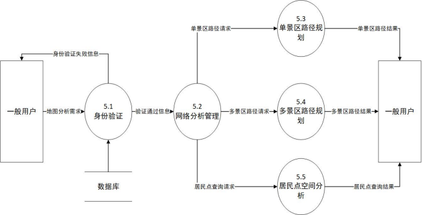{width="5.764583333333333in"
height="2.9444444444444446in"}

图 24 地图分析子系统

当一般用户发出操作请求，需要输入用户ID和密码进行身份验证。验证通过后，就可以进入景区评价子系统，否则系统将显示身份验证失败，要求用户重新输入验证信息。进入系统后，按自身所需进行景区评价发布或景区评价查看，如图所示。

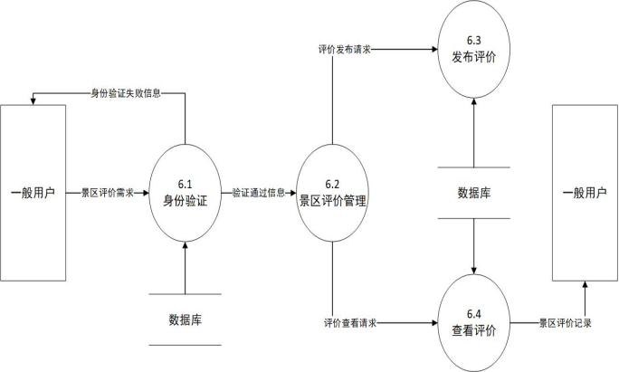{width="5.763888888888889in"
height="3.4631944444444445in"}

图 25 景区评价子系统

**第三层数据流图**

用户在决定查看大屏时，图表可视化系统将从数据库中请求相关数据，对数据进行加工进行可视化展现，并按照一定的布局方式制作大屏，清晰表达四川省旅游景点的相关信息，如图所示。

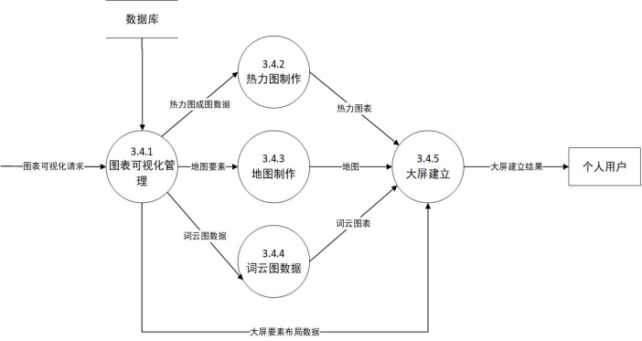{width="5.7625in"
height="3.0618055555555554in"}

图 26 大屏制作

用户选择进行空间查询后，可根据需求在地图上点击市级行政区划，展示该市内的旅行社信息；也可以对景区进行缓冲区分析，查询出附近的居民点信息，供旅客选择住宿地点，如图所示。

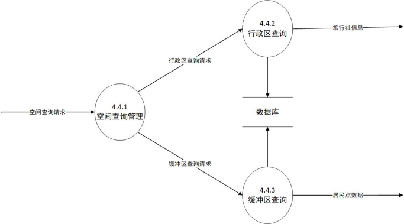{width="5.7625in"
height="3.1979166666666665in"}

图 27 空间查询

# 6.典型界面

## 6.1 系统旅游宣传页

{width="5.75in" height="2.85in"}

图28 系统宣传页

## 6.2 系统注册与登录

{width="5.8805555555555555in"
height="3.44375in"}

图29 系统登录页

## 6.3 地图应用界面

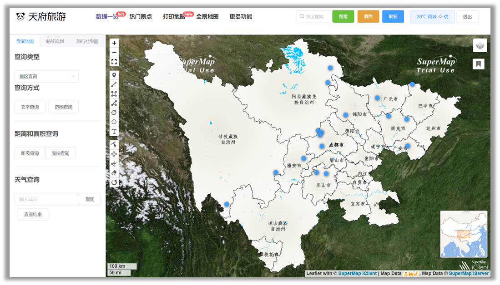{width="5.9840277777777775in"
height="3.41875in"}

图30 地图应用界面

## 6.4 数据一览

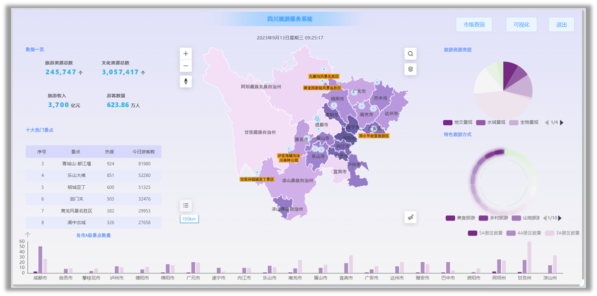{width="6.3694444444444445in"
height="3.1638888888888888in"}

图31 数据大屏

## 6.5 后台管理

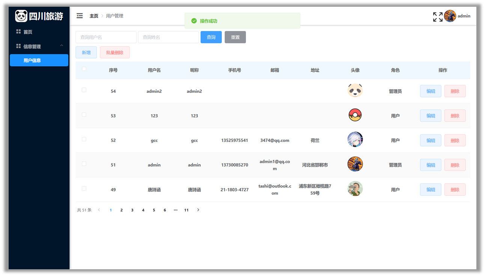{width="6.408333333333333in"
height="3.654861111111111in"}

图32 后台管理

需求分析

**目录**

[1.引言 [4](#引言)](#引言)

[1.1 编写目的 [4](#编写目的)](#编写目的)

[1.2 GIS项目背景 [4](#gis项目背景)](#gis项目背景)

[1.3 软件使用人员 [5](#软件使用人员)](#软件使用人员)

[1.4 定义 [6](#定义)](#定义)

[1.5 参考资料 [6](#参考资料)](#参考资料)

[1.5.1 法律法规 [6](#法律法规)](#法律法规)

[1.5.2 规范标准 [6](#规范标准)](#规范标准)

[1.5.3 政策文件 [6](#政策文件)](#政策文件)

[1.5.4 相关系统 [7](#相关系统)](#相关系统)

[2.GIS项目概述 [7](#gis项目概述)](#gis项目概述)

[2.1 GIS项目 [7](#gis项目)](#gis项目)

[2.1.1 GIS项目目标 [7](#gis项目目标)](#gis项目目标)

[2.1.2 GIS项目内容 [7](#gis项目内容)](#gis项目内容)

[2.1.3 现行系统的调查情况 [8](#现行系统的调查情况)](#现行系统的调查情况)

[2.2 GIS运行环境 [8](#gis运行环境)](#gis运行环境)

[2.2.1 硬件环境 [8](#硬件环境)](#硬件环境)

[2.2.2 软件环境 [9](#软件环境)](#软件环境)

[2.2.3 网络环境 [10](#网络环境)](#网络环境)

[2.3 条件与限制 [10](#条件与限制)](#条件与限制)

[2.3.1 技术限制 [10](#技术限制)](#技术限制)

[2.3.2 数据可用性限制 [11](#数据可用性限制)](#数据可用性限制)

[2.3.3 安全和隐私限制 [11](#安全和隐私限制)](#安全和隐私限制)

[2.3.4 法律和政策限制 [11](#法律和政策限制)](#法律和政策限制)

[3.GIS数据描述 [11](#gis数据描述)](#gis数据描述)

[3.1 GIS数据 [11](#gis数据)](#gis数据)

[3.2 业务数据 [12](#业务数据)](#业务数据)

[3.3 GIS数据库描述 [13](#gis数据库描述)](#gis数据库描述)

[3.3.1 数据表设计 [13](#数据表设计)](#数据表设计)

[3.3.2 E-R图 [15](#e-r图)](#e-r图)

[3.3.3 数据组织 [15](#数据组织)](#数据组织)

[3.4 数据字典 [17](#数据字典)](#数据字典)

[3.4.1 数据流词条 [17](#数据流词条)](#数据流词条)

[3.4.2 数据文件词条 [19](#数据文件词条)](#数据文件词条)

[3.4.3 加工逻辑词条 [20](#加工逻辑词条)](#加工逻辑词条)

[3.4.4 源点及终点词条 [22](#源点及终点词条)](#源点及终点词条)

[4.GIS功能需求 [22](#gis功能需求)](#gis功能需求)

[4.1 系统架构图 [22](#系统架构图)](#系统架构图)

[4.2 功能划分 [23](#功能划分)](#功能划分)

[4.2.1 用户管理功能 [24](#用户管理功能)](#用户管理功能)

[4.2.2 地图浏览功能 [25](#地图浏览功能)](#地图浏览功能)

[4.2.3 地图可视化功能 [25](#地图可视化功能)](#地图可视化功能)

[4.2.4 地图查询功能 [25](#地图查询功能)](#地图查询功能)

[4.2.5 地图分析功能 [25](#地图分析功能)](#地图分析功能)

[4.2.6 景区评价功能 [27](#景区评价功能)](#景区评价功能)

[4.2.7 拓展功能 [27](#拓展功能)](#拓展功能)

[4.3 功能描述与分析 [31](#功能描述与分析)](#功能描述与分析)

[4.3.1 用例图 [31](#用例图)](#用例图)

[4.3.2 数据流图 [33](#数据流图)](#数据流图)

[5.GIS性能需求 [39](#gis性能需求)](#gis性能需求)

[5.1 数据精确度 [39](#数据精确度)](#数据精确度)

[5.2 时间特性 [39](#时间特性)](#时间特性)

[5.3 适应性 [40](#适应性)](#适应性)

[5.4 可靠性 [40](#可靠性)](#可靠性)

[6. GIS运行需求 [40](#gis运行需求)](#gis运行需求)

[6.1 用户界面 [40](#用户界面)](#用户界面)

[6.1.1 屏幕格式 [40](#屏幕格式)](#屏幕格式)

[6.1.2 地图符号设计 [41](#地图符号设计)](#地图符号设计)

[6.1.3地图图表设计 [42](#地图图表设计)](#地图图表设计)

[6.2 硬件接口 [42](#硬件接口)](#硬件接口)

[6.3 软件接口 [42](#软件接口)](#软件接口)

[6.4 故障处理 [42](#故障处理)](#故障处理)

[7. 质量保证 [43](#质量保证)](#质量保证)

[7.1 准确性保证 [43](#准确性保证)](#准确性保证)

[7.2 完整性保证 [44](#完整性保证)](#完整性保证)

[7.3 可行性保证 [44](#可行性保证)](#可行性保证)

[7.4 一致性保证 [45](#一致性保证)](#一致性保证)

[7.5 可追溯性保证 [45](#可追溯性保证)](#可追溯性保证)

[7.6 易读性和可理解性保证
[46](#易读性和可理解性保证)](#易读性和可理解性保证)

[8. 其他需求 [46](#其他需求)](#其他需求)

[8.1 安全保密性 [46](#安全保密性)](#安全保密性)

[8.2 可用性 [47](#可用性)](#可用性)

[8.3 可移植性 [47](#可移植性)](#可移植性)

[8.4 其他要求 [47](#其他要求)](#其他要求)

# 1.引言

## 1.1 编写目的

本文档将会对"天府之国"------四川省旅游资源现状、游客对四川省旅游过程中的痛点和需求进行分析，总结出基于WebGIS的四川省旅游系统需求分析报告，为系统的建设提供基础依据。

本文档主要是开发人员进行系统设计开发的主要依据，是数据分析、设计和软件系统开发的主要依据之一。

## 1.2 GIS项目背景

艰苦卓绝的三年新冠疫情抗争接近尾声，2023年随着疫情防控政策逐渐放开，在政府出台的一系列支持或惠及旅游企业的政策措施下，旅游业努力克服多重因素影响，统筹做好疫情防控和恢复发展。四川省有着得天独厚的自然资源、璀璨夺目的文化瑰宝、五彩斑斓的民俗生活，有着"天府之国"美誉的四川省一直以来作为旅游强省吸引八方游客。

旅游业传统的发展模式是"圈山圈水收门票,人山人海吃红利"的流量思维,但在全域旅游战略下,特别是预约、限流新常态下,大客流模式存在全域化、分散化、线上化迁移的可能。旅游业的开放式发展,已在"旅游+"和"+旅游"的融合发展上持续加深,基于文化和旅游融合逐步进入深水区，在线经济和文化融合成为行业进一步创新发展的动力。而旅游行业与地理空间关系紧密，基于GIS系统，使得用户可以根据关键信息进行智能匹配，快速查询目标兴趣区，提高了旅游信息获取的效率。

四川位于民族东西交融、南北过渡的走廊，糅合吸收民族之长，聚居藏、羌、纳西等55个少数民族，拥有独特的地域文化和绚丽的民族风情，丰富的红色文化与古蜀文明交相辉映，相得益彰。但是，目前四川旅游存在住宿选取、景点选取困难的痛点，高海拔地区住宿区距离远，无法准确定位住宿点，大部分景点知名度不高，存在信息查询困难，位置准确度不高等问题；极端天气突发，可视化程度低四川地处碰撞板块，地质灾害频发，加上高原极端天气，危险性高；在线交流困难在出行和计划时期，不能时刻了解景点客流量、住宿、天气情况等信息，同时高海拔信号差，不能准确获取信息判断是否满足出行需求；路线规划复杂山区地势复杂，存在交通拥堵和道路不明等情况，导致不能快速定位景点和住宿位置。

因此，开发一款解决上诉痛点和需求的系统即四川省旅游WebGIS系统，能够提升游客的旅游体验和满意度。通过该系统，游客可以轻松获取准确的住宿和景点信息，了解目标地区的天气和地质情况，实时获取景点客流量和天气情况等信息，规划最佳的旅行路线，并与其他游客和旅游机构进行在线交流和信息分享。

该系统的目标是打破传统旅游发展模式的局限性，适应全域旅游战略和新常态下的需求变化。通过结合文化和旅游的融合发展，以及在线经济的发展，该系统将为四川旅游业带来创新发展的动力。

系统的开发旨在提供用户友好的界面和交互方式，确保用户可以轻松地浏览和查询旅游信息，进行智能匹配和快速定位目标兴趣区。同时，系统将充分考虑四川地区的特点和复杂性，提供可视化的天气和地质信息，解决高海拔地区的住宿和景点选取困难。此外，系统还将整合各类旅游资讯和实用工具，帮助游客获取全面的旅游信息，应对路线规划复杂、在线交流困难等问题。

综上所述，四川省旅游WebGIS系统的开发旨在为游客提供便捷、准确的旅游信息服务，访问便捷，操作简单。可以提供基于四川省景区信息的统计和大数据可视化服务，展示四川省A级景区的分布情况；提供空间查询服务，精确查询并实时展示目标区域内景区和旅行社信息；可以提供空间分析能力，提供最佳自驾路径分析和多景区旅游自驾路径规划服务，操作简单，精准查询并展示目的地A级旅游景区位置和添加多个旅游景区，并可以分析并展示从地图任意地点到目的景区的最佳自驾路径，规划多目的景区旅游最佳自驾路径。满足他们的住宿、景点选择、天气和地质情况查询、路线规划等需求，促进四川旅游业的恢复和发展。

## 1.3 软件使用人员

本系统使用人员分为游客和旅游系统管理人员

（1）游客：游客没有对专业GIS系统的储备知识，要求系统逻辑简单；游客需要便捷地使用景点查询、住宿点查询、旅游社查询、路线规划、地质灾害查询、用户交流等功能。

（2）旅游系统管理人员：旅游系统管理人员需要对用户信息和景区评论信息进行管理，及时更新旅游社信息和地质灾害预警信息；要求熟悉MySQL数据库操作，能够完成数据库的备份与恢复；熟悉网络维护和服务器维护，避免因网络攻击和硬件故障导致的系统崩溃。

## 1.4 定义

+-------------------+----------------------------------------------------------------------------------------------------------------------+
| **术语**          | **定义与解释**                                                                                                       |
+===================+======================================================================================================================+
| 本系统            | 基于WebGIS的四川旅游资源服务系统                                                                                     |
+-------------------+----------------------------------------------------------------------------------------------------------------------+
| GIS               | 地理信息系统                                                                                                         |
+-------------------+----------------------------------------------------------------------------------------------------------------------+
| 数据字典          | 软件系统中使用的所有数据项的名字及与这些数据项有关的特性（例如，数据项长度、表示等）的集合。                         |
|                   |                                                                                                                      |
| data dictionary   |                                                                                                                      |
+-------------------+----------------------------------------------------------------------------------------------------------------------+
| 数据流图          | 系统的一种图形表示，其中表示出数据源、数据汇、存储和以结点形式对数据执行的处理，以及结点间作为连接部分的逻辑数据流。 |
|                   |                                                                                                                      |
| data flow chart   |                                                                                                                      |
+-------------------+----------------------------------------------------------------------------------------------------------------------+
| 元数据 metadata   | 对数据进行描述的数据记录                                                                                             |
+-------------------+----------------------------------------------------------------------------------------------------------------------+

: 表 1 术语注释

## 1.5 参考资料

### 1.5.1 法律法规

《中华人民共和国计算机信息系统安全保护条例》；

《计算机软件保护条例》；

《中华人民共和国慈善法》

### 1.5.2 规范标准

《计算机软件需求规格说明规范 GB/T 9385-2008》；

《地理信息系统软件测试规范 GB/T 33447-2016》；

《基础地理信息系统技术规程 DB11/T 545-2019》

### 1.5.3 政策文件

《"十四五"旅游业发展规划》；

《国务院办公厅关于进一步激发文化和旅游消费潜力的意见》；

《文化和旅游部关于推动在线旅游市场高质量发展的意见》

### 1.5.4 相关系统

四川旅游网（https://www.517sc.com/）

"蜀地出游计"-四川省旅游分析服务系统

基于Python Django四川旅游景点推荐系统

SuperMap Online

# 2.GIS项目概述

## 2.1 GIS项目

### 2.1.1 GIS项目目标

1.  用户管理：实现对系统的游客信息的注册、登录与信息管理。

2.  地图浏览：实现四川省旅游资源的地图展示，实现基本的浏览、平移、缩放功能。

3.  地图可视化：实现四川省旅游资源地理信息的可视化展示：通过WebGIS技术，将四川省旅游资源信息以地图、图表等形式进行可视化展示，方便用户直观地了解四川省旅游资源的情况。

4.  地图查询：通过WebGIS技术，实现对四川省旅游资源信息的查询和分析，例如根据地理位置、景点类型等条件进行筛选和统计；实现旅行社及住宿地点预订和管理功能，方便用户在线咨询旅行社及住宿地点查询。

5.  地图分析：通过WebGIS技术，实现旅游线路规划和推荐功能，根据用户的偏好和需求，推荐适合的旅游线路和景点。

6.  拓展功能：通过WebGIS技术，实现旅游安全监控和预警功能，实现对旅游区域的安全情况如天气预警和地质灾害预警，保障游客的安全。

### 2.1.2 GIS项目内容

1.  四川省旅游资源地理信息数据采集和整合：通过各种方式，如人工调查、遥感影像等，对四川省旅游资源进行地理信息数据的采集和整合，建立全面的地理信息数据库。

2.  四川省旅游资源服务地理信息系统(GIS)平台建设：基于地理信息数据库，建设GIS平台，实现对四川省旅游资源的可视化展示、景区位置查询、多景区自驾路线分析等功能。

3.  四川省旅游线路规划和优化：通过GIS技术，对四川省旅游交通数据进行空间分析和规划，优化旅游线路，提高游客满意度。

4.  WebGIS应用程序开发：根据需求，开发各种WebGIS应用程序，例如地图浏览、景点介绍、旅行社预订、多景区自驾路线分析等。

### 2.1.3 现行系统的调查情况

1.  用户数量和使用频率：根据相关数据统计，目前基于WebGIS的旅游资源服务系统已经成为旅游行业中不可或缺的一部分，用户数量和使用频率也在逐年增长。

2.  功能和服务范围：基于WebGIS的旅游资源服务系统的功能和服务范围也越来越广泛，包括景点介绍、路线规划、酒店预订、交通出行等多个方面。

3.  用户体验和满意度：基于WebGIS的旅游资源服务系统的用户体验和满意度也得到了不断提升，许多系统已经实现了智能化推荐、语音导航等功能，提高了用户的使用体验。

4.  数据安全和隐私保护：随着数据安全和隐私保护的重要性日益凸显，许多基于WebGIS的旅游资源服务系统也开始加强数据安全和隐私保护措施，例如加密传输、权限控制等。

5.  技术创新和应用拓展：基于WebGIS的旅游资源服务系统也在不断进行技术创新和应用拓展，例如人工智能、大数据等技术的应用，以及与其他行业的融合和创新。

## 2.2 GIS运行环境

### 2.2.1 硬件环境

1.  服务器

采用两台服务器，一台服务器负责运行SuperMap
iServer以发布地图数据和负责SQL Server
2008数据库管理，使数据持久化，对用户端请求进行处理和回复；另一台服务器负责存放系统和组件。SuperMap
iServer是基于高性能GIS内核的云GIS应用服务器，提供多层次扩展开发能力。

  -----------------------------------------------------------------------
          内存                              2GB以上；
  --------------------- -------------------------------------------------
       中央处理器                       双核2.5GHZ以上；

          硬盘                     东芝企业级容量型硬盘4TB\*3

          网卡                               双千兆
  -----------------------------------------------------------------------

  : 表 2 机器推荐配置

2.  用户设备

安装并可以运行主流浏览器（Microsoft Edge、Google
Chrome、Firefox）的电脑即可。

### 2.2.2 软件环境

1.  操作系统

本地系统为Microsoft Windows 10个人版，有能力时可选择CentOS Linux系统。

2.  数据库管理软件

本系统数据库选择SQL Server
2008数据库，它具有便捷性、合适分布式系统的可伸缩性、用以决策支持的数据服务、与很多别的服务器软件密不可分的集成性、优良的性价比等；并且作为可伸缩性和速度方面测试中的记录保持者，SQL
Server是具备完全web支持的数据库系统，提供了了对可拓展编译语言(XML)的核心支持及其在Internet上和服务器防火墙外进行查询的能力。

3.  GIS平台

本系统GIS平台选择SuperMap iClient JavaScript
11i（2023）云GIS网络客户端开发平台，该平台基于现代Web基于现代 Web
技术栈全新构建，是 SuperMap云 GIS 和在线 GIS 平台系列产品的统一
JavaScript 客户端。集成了领先的开源地图库和可视化库，且核心代码以 Apache
License 2.0
协议完全开源，连接了SuperMap与开源社区。提供了全新的大数据可视化和数据流可视化功能，通过该产品可快速实现浏览器和移动端上美观、流畅的地图呈现与空间分析。

4.  数据发布工具

本系统的地图和要素服务采用SuperMap iServer进行发布，iServer是基于跨平台
GIS 内核的云 GIS
应用服务器，是云端一体化技术的重要组成部分。具有二三维一体化的服务发布、管理与聚合功能，提供多层次的扩展开发能力，采用面向服务的地理信息共享方式，用于构建
SOA 应用系统和 GIS 私有云系统。

5.  数据处理工具

本系统源数据处理采用SuperMap iDesktopX
进行创建工作空间，拓扑分析，构建网络数据集的操作。

6.  开发工具

本系统开发工具选择Visual Studio Code，进行网页代码编写及Leaflet
API引入。

7.  软件配置

+---------------------------------------------------+-------------------------+
| **软件分类**                                      | **软件选型**            |
+=========================+=========================+=========================+
| 系统软件                | 个人计算机（服务器）    | CentOS Linux            |
+-------------------------+-------------------------+-------------------------+
| 数据库软件                                        | MySQL8.0                |
+-------------------------+-------------------------+-------------------------+
| GIS软件                 | GIS开发平台             | SuperMap iClient for    |
|                         |                         | JavaScript、Leaflet     |
|                         +-------------------------+-------------------------+
|                         | GIS数据发布软件         | SuperMap iServer        |
|                         +-------------------------+-------------------------+
|                         | GIS数据处理软件         | SuperMap iDesktopX      |
+-------------------------+-------------------------+-------------------------+
| 开发工具                | Visual Studio Code                                |
+-------------------------+---------------------------------------------------+

: 表 3 软件配置

### 2.2.3 网络环境

把该网络连成局域网形式，数据存储在一台个人计算机（服务器）上，用户通过浏览器和服务器进行连接并访问该系统，进行相关的操作。

## 2.3 条件与限制

### 2.3.1 技术限制

1.  缺乏对大数据的处理能力：旅游系统可能需要处理大量的数据，包括用户信息、旅游资源信息、天气数据等。如果开发团队缺乏对大数据的处理技术和基础设施，可能无法高效地存储、处理和分析这些数据，从而影响系统的性能和响应速度。

2.  对开发科学有效的地质灾害预警模块技术能力不足：四川地质灾害频发，在旅游系统中设计一个科学有效的地质灾害预警模块十分有必要。但是限于时间、成本和技术原因，开发完整的地质灾害预警模块（包括遥感数据获取、智能数据解译、预警信息发布及应灾处理）十分困难，目前设计为发布历史及应急处理部门发布的灾害信息及模拟应灾逃生路线，结构为可扩展性，便于之后逐步完善功能。

3.  对于高并发的支持不足：旅游系统在繁忙的旅游季节或热门景点可能面临高并发的访问量。如果系统架构和服务器配置不足以支持大量并发访问，可能会导致系统响应缓慢、崩溃或服务不可用的情况。

4.  缺乏可扩展性和弹性：旅游系统的需求可能会随着时间和用户增长而变化。如果系统架构和设计缺乏可扩展性和弹性，无法轻松适应未来的用户增长和功能扩展，可能会面临性能瓶颈和系统崩溃的风险。

### 2.3.2 数据可用性限制

天气数据可能受限于供应商的数据提供范围和准确性，导致系统无法提供某些地区的实时天气信息。

### 2.3.3 安全和隐私限制

在数据传输和存储过程中，需要采取数据加密、访问控制等安全措施，以保护用户数据不被未经授权的访问和泄露。

### 2.3.4 法律和政策限制

在用户隐私保护方面，开发团队需要遵守相关的隐私政策和数据保护法律，如欧洲的《通用数据保护条例》（GDPR）等。

# 3.GIS数据描述

## 3.1 GIS数据

  -----------------------------------------------------------------------------------------------------
  **数据名称**             **数据类型**            **数据描述**
  ------------------------ ----------------------- ----------------------------------------------------
  四川省居民地             点要素                  四川省居民地地名及位置信息

  四川省A级旅游景区        点要素                  四川省各市5A各级旅游景区

  四川省公路路网           线要素                  四川省公路路网信息

  四川省铁路路网           线要素                  四川省铁路路网信息

  四川省行政区划           面要素                  四川省省市县三级行政区划信息

  四川省水域数据           面要素                  四川省水域分布信息

  四川省旅行社数据         属性表                  四川省旅行社数据，包括旅行社名称、地址和联系方式

  四川省公路网络数据集     交通网络数据集          包含边、汇、转弯网络要素的可流动分析网络数据集服务

  天地图                   WMTS在线数据服务        提供矢量和影像底图

  SuperMap Online专题图    WMTS在线数据服务        提供专题影像

  地图服务                 WMS和REST数据服务       使用SuperMap iServer发布的四川省地理数据服务

  要素服务                 WFS数据服务和REST服务   使用SuperMap iServer发布的要素服务
  -----------------------------------------------------------------------------------------------------

  : 表 4 GIS数据组织与描述

## 3.2 业务数据

  -----------------------------------------------------------------------
  **数据名称**             **数据类型**   **数据描述**
  ------------------------ -------------- -------------------------------
  用户名                   文本           用户登录系统的名称

  用户密码                 文本           用户登录系统的密钥

  用户偏好                 长文本         用户对景点的偏好信息

  用户评价                 长文本         用户对景点的评价
  -----------------------------------------------------------------------

  : 表 5 业务数据组织与描述

## 3.3 GIS数据库描述

四川省各市、县的旅游地理信息数据存在海量且来源多样等特点，构建旅游地理信息数据库时，将数据库分成空间数据和非空间数据。空间数据主要包括通过天地图调用的基础地理信息，涉及旅游景区、景点数据和相关的"吃、住、行、游、购、娱"六类空间数据；非空间数据主要包括旅游相关文本、照片以及视频等介绍和展示数据。旅游地理信息数据库建设内容示意图如图所示。

<figure>
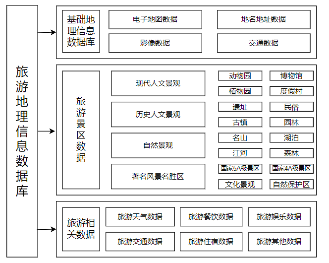
<figcaption>
图 1 旅游地理信息数据库设计
</figcaption>
</figure>

### 3.3.1 数据表设计

1.  用户信息表

表名：User

说明：记录游客的详细信息

  --------------------------------------------------------------------------
  **字段名称**            **字段类型**            **字段说明**
  ----------------------- ----------------------- --------------------------
  User_ID                 varchar                 用户ID，用户的唯一标识码

  User_Name               varchar                 用户昵称

  User_Password           varchar                 用户登录密码

  User_Preference         varchar                 用户景点偏好
  --------------------------------------------------------------------------

  : 表 6 用户信息表

2.  管理员表

表名：Admin

说明：记录管理员信息

  -----------------------------------------------------------------------
  **字段名称**            **字段类型**            **字段说明**
  ----------------------- ----------------------- -----------------------
  Admin_ID                varchar                 管理员ID

  Admin_Password          varchar                 管理员登录密码
  -----------------------------------------------------------------------

  : 表 7 管理员表

3.  景点表

表名：Scenery

说明：记录景点详细信息

  -----------------------------------------------------------------------
  **字段说明**            **字段类型**            **字段说明**
  ----------------------- ----------------------- -----------------------
  Scenery_ID              varchar                 景点ID

  Scenery_Name            varchar                 景点名称

  Scenery_Level           varchar                 景点级别

  Scenery_Type            varchar                 景点类型

  Scenery_Address         varchar                 景点地址（自然语言）

  Scenery_Longitude       double                  景点经度

  Scenery_Latitude        double                  景点纬度
  -----------------------------------------------------------------------

  : 表 8 景点表

4.  景点评论表

表名：Comment

说明：记录游客对景点的评论

  -----------------------------------------------------------------------
  **字段说明**            **字段类型**            **字段说明**
  ----------------------- ----------------------- -----------------------
  Comment_ID              varchar                 评论的ID

  Comment_user_id         varchar                 评论者ID

  Comment_scenery_id      varchar                 被评论景点ID

  Comment_Content         varchar                 评论内容
  -----------------------------------------------------------------------

  : 表 9 景点评论表

### 3.3.2 E-R图

E-R图展示了用户、景点和评论之间的关系。用户实体与景点实体和评论实体有关系。用户与景点之间的关系表示用户对景点有偏好，而评论实体与用户和景点之间的关系表示用户对景点的评论。本分析认为管理员是用户的一种，故并未单独列出管理员实体，E-R图如图所示。

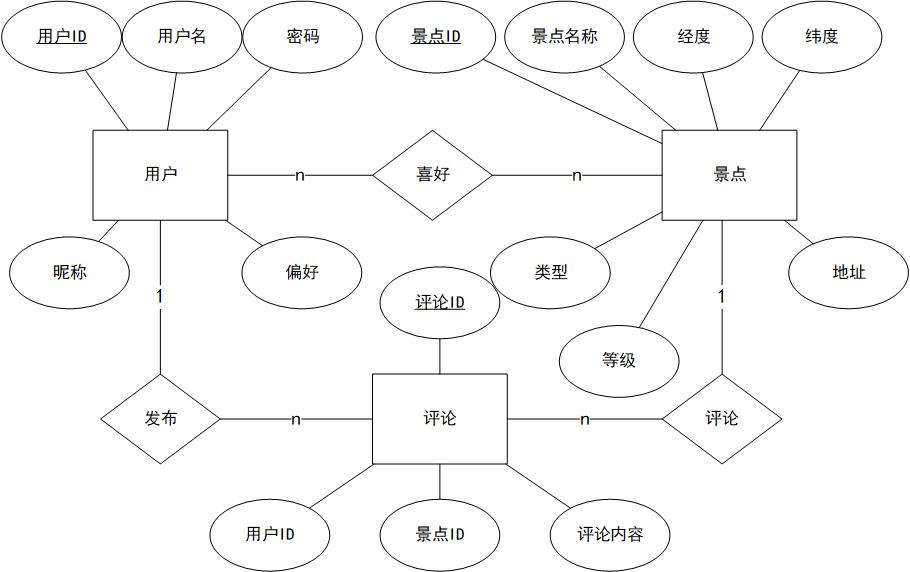{width="5.587949475065617in"
height="3.5124245406824146in"}

### 3.3.3 数据组织

基于WebGIS的四川省旅游资源服务系统涉及两大类数据，即空间数据与业务数据。根据该系统的具体应用，分别对这两类数据进行组织和设计，数据之间的关联如图所示。

{width="5.307352362204725in"
height="3.591359361329834in"}

1.  空间数据

空间数据是指与地理空间相关的数据，包括地理坐标、地图投影、地形地貌、道路交通等信息。在四川省旅游资源服务系统中，空间数据主要用于以下方面：

a)  景点位置信息的采集和管理：通过GPS、遥感等技术获取景点的位置信息，并将其存储在数据库中，方便后续查询和分析。

b)  地图制作和展示：将空间数据转换为可视化的地图形式，方便用户直观地了解景点分布情况、路线规划等信息。

c)  空间分析和规划：利用GIS技术对空间数据进行分析和规划，例如计算多个景点之间的距离、生成多景区最佳自驾路径规划图等。

为了实现这些功能，空间数据需要按照一定的格式和标准进行组织和设计，例如采用WGS84坐标系、EPSG编码等方式。同时，还需要建立空间数据的关联关系，例如景点之间的连通性、道路与景点的关系等。

2.  业务数据

业务数据是指与旅游资源服务相关的数据，包括景点介绍、门票价格、酒店预订等信息。在四川省旅游资源服务系统中，业务数据主要用于以下方面：

a)  景点信息管理：收集和整理景点的各种信息，例如名称、介绍、开放时间、门票价格等，并将其存储在数据库中。

b)  业务流程管理：建立业务流程管理系统，为用户提供快速访问景区、旅行社和酒店的接口，实现景点门票销售、酒店预订等功能。

c)  数据分析和报告：利用业务数据进行分析和报告，例如基于协同过滤算法分析游客偏好进行景点推荐等。

为了实现这些功能，业务数据需要按照一定的格式和标准进行组织和设计，例如采用XML格式、JSON格式等方式。同时，还需要建立业务数据的关联关系，例如景点与酒店之间的关系、门票与景点之间的关系等。

## 3.4 数据字典

### 3.4.1 数据流词条

  ----------------------------------------------------------------------------------------------------------------------------------------------
  数据流名           说明                                   数据流来源               数据流去向                   数据流组成      数据量流通量
  ------------------ -------------------------------------- ------------------------ ---------------------------- --------------- --------------
  用户操作请求信息   一般用户发出操作请求                   一般用户                 加工1-身份验证               {用户ID+密码}   良好

  身份验证失败信息   用户身份验证失败返还信息               加工1-身份验证           一般用户                                     良好

  身份验证通过信息   用户身份验证成功信息                   加工1-身份验证           加工2-当前用户使用功能模块                   良好

  底图切换请求       用户请求实现地图的图层类型切换         加工2.2-地图浏览管理     加工2.3-底图切换                             良好

  底图切换结果       用户实现地图图层类型切换返回结果信息   加工2.3-底图切换         一般用户                                     良好

  浏览操作请求       用户请求实现地图的浏览操作             加工2.2-地图浏览管理     加工2.4-浏览操作                             良好

  浏览操作结果       用户实现地图浏览操作返回结果信息       加工2.4-浏览操作         一般用户                                     良好

  符号可视化需求     用户选择专题符号展示所需信息           加工3.2-可视化管理       加工3.3-展示专题符号                         良好

  专题符号结果       调用相关专题符号以加载地图             加工3.3-展示专题符号     加工3.5-地图加载                             良好

  符号可视化结果     返回专题地图结果给用户                 加工3.5-地图加载         一般用户                                     良好

  图表可视化需求     用户选择图表大屏展示所需信息           加工3.2-可视化管理       加工3.4-展示大屏                             良好

  图表可视化结果     返回图表可视化给用户                   加工3.4-展示大屏         一般用户                                     良好

  属性查询请求       用户请求使用属性查询功能               加工4.2-地图查询管理     加工4.3-属性查询                             良好

  属性查询结果       返回属性查询结果信息给用户             加工4.3-属性查询         一般用户                                     良好

  空间查询请求       用户请求使用空间查询功能               加工4.2-地图查询管理     加工4.4-空间查询                             良好

  空间查询结果       返回空间查询结果信息给用户             加工4.4-空间查询         一般用户                                     良好

  单景区路径请求     用户请求单景区最佳自驾路径分析         加工5.2-网络分析管理     加工5.3-单景区路径规划                       良好

  单景区路径结果     返回单景区最佳自驾路径分析结果         加工5.3-单景区路径规划   一般用户                                     良好

  多景区路径请求     用户请求多景区旅游最佳自驾路径分析     加工5.2-网络分析管理     加工5.4-多景区路径规划                       良好

  多景区路径结果     返回多景区最佳自驾路径分析结果给用户   加工5.4-多景区路径规划   一般用户                                     良好

  居民点查询请求     用户请求查询最近居民点信息             加工5.2-网络分析管理     加工5.5-居民点空间分析                       良好

  居民点查询结果     返回居民点查询结果给用户               加工5.5-居民点空间分析   一般用户                                     良好

  评价发布请求       用户请求发布景区评价                   加工6.2-景区评价管理     加工6.3-发布评价                             良好

  评价查看请求       用户请求查看景区评价                   加工6.2-景区评价管理     加工6.4-查看评价                             良好

  景区评价记录       返回景区评价记录给用户                 加工6.4-查看评价         一般用户                                     良好
  ----------------------------------------------------------------------------------------------------------------------------------------------

  : 表10 数据流词条描述表

### 3.4.2 数据文件词条

  --------------------------------------------------------------------------------------------------------------------------
  数据文件名   简述                   数据文件组成                                                     存储方式   存取频率
  ------------ ---------------------- ---------------------------------------------------------------- ---------- ----------
  用户信息表   记录游客的详细信息     {用户ID+用户昵称+用户登录密码+用户景点偏好}                      关键码     高

  管理员表     记录管理员信息         {管理员ID+管理员登录密码}                                        关键码     低

  景点表       记录景点详细信息       {景点ID+景点名称+景点级别+景点类型+景点地址+景点经度+景点纬度}   关键码     低

  景点评论表   记录游客对景点的评论   {评论的ID+评论者ID+被评论景点ID+评论内容}                        关键码     高
  --------------------------------------------------------------------------------------------------------------------------

  : 表11 数据文件词条描述

### 3.4.3 加工逻辑词条

+----------------+-------------------------+--------------------------------------------------------------------+------------------+------------------------------------------------+--------------------------------+
| 加工名         | 加工编号                | 简要描述                                                           | 输入数据流       | 输出数据流                                     | 加工逻辑                       |
+================+=========================+====================================================================+==================+================================================+================================+
| 身份验证       | 2.1、3.1、4.1、5.1、6.1 | 对用户登录操作进行身份验证                                         | 用户登录操作请求 | 验证通过信息、身份验证失败信息                 | IF用户输入用户ID和密码且均正确 |
|                |                         |                                                                    |                  |                                                |                                |
|                |                         |                                                                    |                  |                                                | THEN验证通过                   |
|                |                         |                                                                    |                  |                                                |                                |
|                |                         |                                                                    |                  |                                                | ELSE身份验证失败               |
+----------------+-------------------------+--------------------------------------------------------------------+------------------+------------------------------------------------+--------------------------------+
| 地图浏览管理   | 2.2                     | 用户选择使用底图切换或地图浏览功能                                 | 验证通过信息     | 底图切换请求、浏览操作请求                     |                                |
+----------------+-------------------------+--------------------------------------------------------------------+------------------+------------------------------------------------+--------------------------------+
| 底图切换       | 2.3                     | 用户选择底图切换操作                                               | 底图切换请求     | 底图切换结果                                   |                                |
+----------------+-------------------------+--------------------------------------------------------------------+------------------+------------------------------------------------+--------------------------------+
| 浏览操作       | 2.4                     | 用户选择地图浏览操作                                               | 浏览操作请求     | 浏览操作结果                                   |                                |
+----------------+-------------------------+--------------------------------------------------------------------+------------------+------------------------------------------------+--------------------------------+
| 可视化管理     | 3.2                     | 用户选择使用符号可视化或图表可视化                                 | 验证通过信息     | 符号可视化需求、图表可视化需求                 |                                |
+----------------+-------------------------+--------------------------------------------------------------------+------------------+------------------------------------------------+--------------------------------+
| 展示专题符号   | 3.3                     | 用户选择符号可视化地图                                             | 符号可视化需求   | 专题符号结果                                   |                                |
+----------------+-------------------------+--------------------------------------------------------------------+------------------+------------------------------------------------+--------------------------------+
| 地图加载       | 3.5                     | 加载符号可视化地图                                                 | 专题符号结果     | 符号可视化结果                                 |                                |
+----------------+-------------------------+--------------------------------------------------------------------+------------------+------------------------------------------------+--------------------------------+
| 展示大屏       | 3.4                     | 使用图表大屏展示相关信息                                           | 图表可视化需求   | 图表可视化结果                                 |                                |
+----------------+-------------------------+--------------------------------------------------------------------+------------------+------------------------------------------------+--------------------------------+
| 地图查询管理   | 4.2                     | 用户选择使用属性查询功能或空间查询功能                             | 验证通过信息     | 属性查询请求、空间查询请求                     |                                |
+----------------+-------------------------+--------------------------------------------------------------------+------------------+------------------------------------------------+--------------------------------+
| 属性查询       | 4.3                     | 用户使用属性查询操作                                               | 属性查询请求     | 属性查询结果                                   |                                |
+----------------+-------------------------+--------------------------------------------------------------------+------------------+------------------------------------------------+--------------------------------+
| 空间查询       | 4.4                     | 用户使用空间查询操作                                               | 空间查询请求     | 空间查询结果                                   |                                |
+----------------+-------------------------+--------------------------------------------------------------------+------------------+------------------------------------------------+--------------------------------+
| 网络分析管理   | 5.2                     | 用户选择单景区最佳自驾路径分析、多景区最佳自驾路劲分析或居民点查询 | 验证通过信息     | 单景区路径请求、多景区路径请求、居民点查询请求 |                                |
+----------------+-------------------------+--------------------------------------------------------------------+------------------+------------------------------------------------+--------------------------------+
| 单景区路径规划 | 5.3                     | 用户使用单景区最佳自驾路径分析                                     | 单景区路径请求   | 单景区路径结果                                 |                                |
+----------------+-------------------------+--------------------------------------------------------------------+------------------+------------------------------------------------+--------------------------------+
| 多景区路径规划 | 5.4                     | 用户使用多景区最佳自驾路径分析                                     | 多景区路径请求   | 多景区路径结果                                 |                                |
+----------------+-------------------------+--------------------------------------------------------------------+------------------+------------------------------------------------+--------------------------------+
| 居民点空间分析 | 5.5                     | 用户使用最短居民点路径查询                                         | 居民点查询请求   | 居民点查询结果                                 |                                |
+----------------+-------------------------+--------------------------------------------------------------------+------------------+------------------------------------------------+--------------------------------+
| 景区评价管理   | 6.2                     | 用户选择评价发布或评价查看                                         | 验证通过信息     | 评价发布请求、评价查看请求                     |                                |
+----------------+-------------------------+--------------------------------------------------------------------+------------------+------------------------------------------------+--------------------------------+
| 发布评价       | 6.3                     | 用户发布景区评价                                                   | 评价发布请求     |                                                |                                |
+----------------+-------------------------+--------------------------------------------------------------------+------------------+------------------------------------------------+--------------------------------+
| 查看评价       | 6.4                     | 用户查看景区评价记录                                               | 评价查看请求     | 景区评价记录                                   |                                |
+----------------+-------------------------+--------------------------------------------------------------------+------------------+------------------------------------------------+--------------------------------+

表12 加工逻辑词条描述

### 3.4.4 源点及终点词条

  ---------------------------------------------------------------------------------------------------------
  名称              简要描述             有关数据流                                       数目
  ----------------- -------------------- ------------------------------------------------ -----------------
  一般用户          主要是游客           用户登录操作、用户功能操作                       1000

  管理员用户        系统运维和管理人员   管理员登录操作、用户管理操作、系统维护管理操作   4
  ---------------------------------------------------------------------------------------------------------

表13 源点及终点词条描述

# 4.GIS功能需求

## 4.1 系统架构图

四川省旅游资源服务系统基于SOA架构，采用B/S结构进行开发和设计。本系统框架主要分为基础设施层、数据资源层、服务层、应用综合层以及用户层。本系统框架设计示意图如图所示。

系统框架设计说明：

1.  基础设施层主要包括系统运行的软硬件设施，如服务器、存储设备、GIS平台等；

2.  数据资源层为系统应用提供基础地理信息数据和各类旅游信息资源数据，如旅游景点数据、旅游路线、餐饮住宿等；

3.  服务层是按照一定的标准，以服务的方式进行聚合，从而提高系统开发效率，常用的服务有地图服务、查询服务、定位服务等；

4.  应用综合层是用户能够应用的功能，主要包括旅游地理信息浏览、GIS基本操作、景区街景展示、以及景区自驾路线等；

5.  用户层是系统使用人员，主要包括系统管理员、游客等。

<figure>
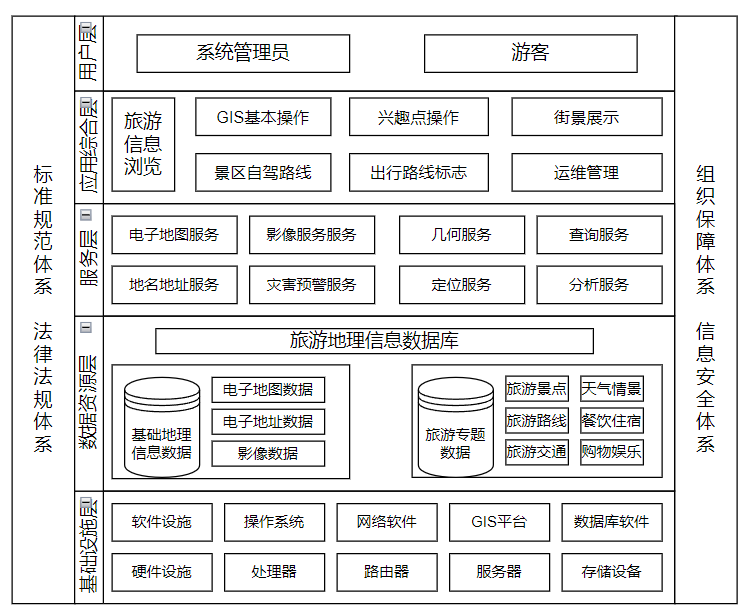
<figcaption>
图 4 系统框架设计
</figcaption>
</figure>

## 4.2 功能划分

基于WebGIS的四川省旅游资源服务系统的结构与功能从总体结构和功能分配方面统一考虑,系统的数据库及软件模块将可以在其它子系统中进行重用，以减少今后系统开发和维护的工作量。

按照功能构成，软件系统可分为七个主要部分：用户管理功能、地图浏览功能、地图可视化功能、地图查询功能、地图分析功能、景区评价功能和拓展功能。其功能结构图如图5所示。

{width="5.767361111111111in"
height="3.720833333333333in"}

具体功能如下：

1.  用户管理功能：用户注册模块、用户登录模块、用户信息修改模块。

2.  地图浏览功能：底图切换模块、浏览操作模块。

3.  地图可视化功能：专题符号模块、Echarts图表模块、热力图模块。

4.  地图查询功能：景点查询模块、旅行社查询模块、缓冲区住宿查询模块。

5.  地图分析功能：最佳自驾路径分析模块、多景区旅游自驾路径分析模块。

6.  景区评价功能：查看和发布评价模块、管理评价模块。

7.  拓展功能：天气功能模块、基于协同过滤算法的景点推荐模块、地质灾害预警模块、VR场景模块。

### 4.2.1 用户管理功能

1.  用户可以注册、登录、修改个人信息；

2.  管理员可以添加、修改、删除用户的信息。

### 4.2.2 地图浏览功能

1.  使用天地图为系统底图,可切换天地图图层类型,实现地图的图层类型切换;

2.  实现地图的基本浏览操作,包括放大、缩小、平移，并在系统加载时，默认显示为四川省的可视范围。

### 4.2.3 地图可视化功能

1.  对地图符号系统进行分专题设计，对地图中展示四川省A级景区的分布情况;

2.  使用ECharts的丰富图表,在地图中清晰表达四川省各市的5A、4A、3A级旅游景点数量。

3.  提供旅游信息热点词云及旅游热力图，实现旅游和住宿的大屏可视化。

### 4.2.4 地图查询功能

1.  在搜索框内输入旅游景区名称，定位该景点位置，点击景区位置展示该旅游景区的属性信息；

2.  在地图上点击市级行政区划，展示该市内的旅行社信息；

3.  对景区进行缓冲区分析，查询出附近的居民点信息，供旅客选择住宿地点。

### 4.2.5 地图分析功能

1.  最佳自驾路径：要求可以查询并展示目的地A级旅游景区位置，并可以分析并展示从地图任意地点到目的景区的最佳自驾路径；

最佳路径分析，是求解网络中两点之间阻抗最小的路径，必须按照节点的选择顺序访问网络中的结点。"阻抗最小"有多种理解，如基于单因素考虑的时间最短、费用最低、风景最好、路况最佳、过桥最少、收费站最少、经过乡村最多等。本项目的最佳自驾路径主要考虑时间最短的路径求解，示例图如图所示。

{width="6.1698687664042in"
height="3.5603991688538934in"}

2.  多景区旅游自驾路径规划：查询并添加多个旅游景区，规划多目的景区旅游最佳自驾路径。

多景区旅游自驾路径规划实际上可以归为时间最短情况下，按照结点的选择顺序访问网络中的结点所求求解出的网络中两点之间阻抗最小的路径，示例图如图所示。

{width="6.1428291776028in"
height="3.7232425634295714in"}

3.  查找最近居民点功能：尽管上面的地图分析可以查询出附近的居民点信息，但想要准确查询到现实情况中花费时间最短到达的居民点，需要依靠网络分析中查找最近设施来实现。同时，一旦遇到应急情况，需要规划逃生路线时，查找最近设施能够为游客争取宝贵的时间。

最近设施分析是指在网络上给定一个事件点和一组设施点，为事件点查找以最小耗费能到达的一个或几个设施点，结果显示从事件点到设施点(或从设施点到事件点)的最佳路径，耗费，及行驶方向。例如事件发生点是一起交通事故，要求查找在10分钟内能到达的最近医院，超过10分钟到达的都不予考虑。此例中，事故发生地即是一个事件点，周边的医院则是设施点。最近设施查找实际上也是一种路径分析，因此，同样可以应用障碍边和障碍点的设置，在行驶路途上这些障碍将不能被穿越，在路径分析中会予以考虑，示例图如图所示。

{width="5.895774278215223in"
height="3.616583552055993in"}

### 4.2.6 景区评价功能

1.  用户可以查看和发布景区的评论信息,包括注意事项、景区评价等信息；

2.  管理员对不合理的评论信息进行管理，维护正常秩序。

### 4.2.7 拓展功能

1.  天气功能

四川省地处中国西南地区，气候多样，天气变化较为频繁，因此在旅游系统中引入一个天气模块是非常有必要的。该模块可以为游客提供准确的天气信息，帮助他们做出合理的行程安排和准备，提升旅游体验和安全性。

和风天气开发服务基于先进的气象和人工智能算法，为广大开发者和企业提供了丰富、精准的天气数据服务，帮助你在应用中展示天气，或助力你的业务决策。这一切都可以通过和风天气提供的开发工具，轻松的集成。天气模块可以集成天气警报和提示功能，当出现恶劣天气条件（如暴雨、雷电、大风等）时，系统可以向用户发送警报或提示信息，提醒他们采取相应的安全措施，确保旅游活动的安全。该模块应允许用户选择具体的地区或景点，以获取该地区的天气信息。天气模块提供天气预报功能，包括未来几天的天气状况、气温、降水概率、风力等信息。这样游客可以提前知道目的地的天气情况，为行程安排和装备选择做出合理的决策，天气效果如图所示。

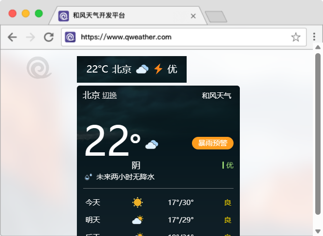{width="5.555956911636046in"
height="4.409436789151356in"}

2.  基于协同过滤算法的景点推荐功能

基于协同过滤的推荐算法，核心思想是很朴素的"物以类聚、人以群分"的思想。所谓物以类聚，就是计算出每个景点最相似的景点列表，我们就可以为用户推荐用户喜欢的景点相似的景点，这就是基于物品的协同过滤。所谓人以群分，就是我们可以将与该用户相似的用户喜欢过的景点推荐给该用户(而该用户未曾操作过)，这就是基于用户的协同过滤。具体思想可以如图所示。

{width="5.202209098862642in"
height="3.7714829396325458in"}

协同过滤的核心是怎么计算景点之间的相似度以及用户之间的相似度。我们可以采用非常朴素的思想来计算相似度。我们将用户对景点的评分构建如下用户行为矩阵，矩阵的某个元素代表某个用户对某个景点的评分。其中行向量代表某个用户对所有景点的评分向量，列向量代表所有用户对某个景点的评分向量。有了行向量和列向量，我们就可以计算用户与用户之间、景点与景点之间的相似度了。具体来说，行向量之间的相似度就是用户之间的相似度，列向量之间的相似度就是景点之间的相似度。我们分析的是不同游客在景点喜好上的相似度。

{width="1.6875in"
height="0.7604166666666666in"}

相似度计算可以使用余弦相似度，计算方法如下：

{width="2.125in"
height="0.4166666666666667in"}

根据上面算法思想的介绍，我们可以将与该用户最相似的用户喜欢的景点推荐给该用户。这就是基于用户的协同过滤的核心思想。

用户u对景点s的喜好度{width="0.90625in"
height="0.23958333333333334in"}可以采用如下公式计算，其中{width="0.14583333333333334in"
height="0.15625in"}是与该用户最相似的用户集合(我们可以基于用户相似度找到与某用户最相似的K个用户)，{width="0.9479166666666666in"
height="0.23958333333333334in"}是用户{width="0.16666666666666666in"
height="0.14583333333333334in"}对景点{width="0.10416666666666667in"
height="0.11458333333333333in"}的喜好度，{width="0.8125in"
height="0.23958333333333334in"}是用户{width="0.16666666666666666in"
height="0.14583333333333334in"}与用户{width="0.125in"
height="0.11458333333333333in"}的相似度。

{width="3.1979166666666665in"
height="0.5in"}

有了用户对每个标的物的评分，基于评分降序排列，就可以取评分最高的N个推荐给用户了。

3.  地质灾害预警

四川地处地震多发区和复杂地质环境的地区，地质灾害是该地区旅游系统面临的重要风险之一。为了提高旅游系统的安全性和可持续发展，建立一个地质灾害预警模块是非常重要的，四川省历史地震示例图如图所示，来自SuperMap
Online。由于技术限制，我们需要将此模块设计成可拓展性的功能，逐步实现以下设计：

{width="5.30696084864392in"
height="3.17078302712161in"}

a)  数据收集：通过收集和检测与地质灾害相关的数据，包括地震、滑坡、泥石流等地质灾害的监测数据。这些数据可以通过地质监测仪器、传感器、卫星遥感等手段获取，并建立实时监测系统，以及相关的数据库用于存储和处理数据。

b)  风险评估和预测：通过对收集到的地质灾害数据进行分析和处理，可以对潜在的地质灾害风险进行评估和预测。可以利用数据分析和机器学习技术，建立预测模型，识别出可能发生地质灾害的地点和时间，并对其潜在影响进行评估。结合本系统的可视化功能，可以直观地展示灾害范围和影响。

c)  预警系统和信息发布：一旦地质灾害风险达到预警级别，预警系统应能够迅速发出警报并向相关方发送预警信息。这些预警信息可以通过手机短信、电子邮件、社交媒体等多种渠道传达给游客、旅行社、酒店等旅游系统的相关方，以便他们能够及时采取应对措施，减少风险。

d)  应急响应和安全指南：地质灾害预警模块还应提供应急响应和安全指南，为游客和旅游从业人员提供相关的安全建议和行动指南。这些指南可以包括疏散路线、避险区域、急救知识等，以帮助他们在发生地质灾害时做出正确的反应和保护自己的行动。

总体而言，四川旅游系统的地质灾害预警模块需要建立一个完善的数据收集、监测、评估和预警系统，结合科学的地质灾害风险评估和预测技术，及时向相关方发布预警信息，并提供相关的应急响应和安全指南。这样可以提高旅游系统的安全性，保护游客和从业人员的生命财产安全，并促进旅游业的可持续发展。当然限于目前的技术基础，此模块需要逐步实现。

4.  VR场景

四川省旅游系统中引入VR全景地图模块可以为游客提供沉浸式的旅游体验，使其能够在虚拟环境中亲身感受目的地的美景和文化特色。VR全景地图模块应包括四川省部分旅游目的地的地理覆盖，并展示主要景点的全景照片或视频。这样的模块可以为游客提供更直观、真实的感受，让他们在虚拟环境中仿佛置身于目的地之中，为接下来的旅行做足准备，示例图如图所示：

{width="5.4250896762904635in"
height="2.6328871391076114in"}

## 4.3 功能描述与分析

### 4.3.1 用例图

用例图（Use Case
Diagram）是用户与系统交互的最简表示形式，展现了用户和与他相关的用例之间的关系。通过用例图，人们可以获知系统不同种类的用户和用例。用例图下面将和数据流图配合使用，用例图如图所示。

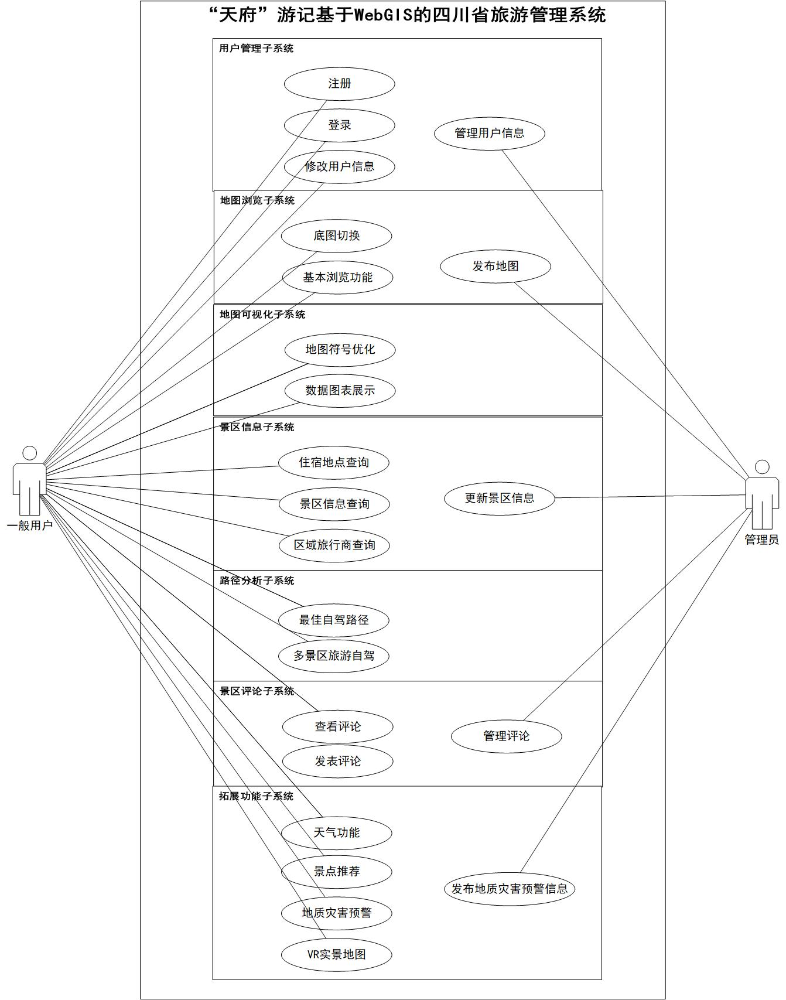{width="6.180049212598425in"
height="7.860912073490813in"}

系统包括一般用户（游客）和管理员2个角色，用户管理、地图浏览、地图可视化、景区信息、路径分析、景区评论和拓展功能7个子系统，注册、登录、修改用户信息等23个用例。与管理员关联的用例有管理用户信息、发布地图、更新景区信息、管理评论和发布地质灾害预警信息5个用例，与用户关联的用例有注册、登录、修改用户信息等18个用例。

### 4.3.2 数据流图

数据流图（Data Flow
Diagram）：简称DFD，它从数据传递和加工角度，以图形方式来表达系统的逻辑功能、数据在系统内部的逻辑流向和逻辑变换过程，是结构化系统分析方法的主要表达工具及用于表示软件模型的一种图示方法。数据在系统中流动和处理的过程。下面，我们使用分层的数据流图来详细表述数据在系统中流动和处理的过程。

**顶层数据流图**

用户群体由一般用户和管理员用户组成。不同用户群体使用系统目标不同故相应功能使用权限不同。其中，一般用户可进行用户信息的更新、对地图进行浏览、查询和分析处理以及可视化、景区评价以及一系列拓展功能的操作，管理员用户则是主要进行对用户信息的维护，如图所示。

{width="6.005635389326335in"
height="4.47241469816273in"}

**第一层数据流图**

整个系统可分为七个子系统：用户管理子系统、地图浏览子系统、可视化子系统、地图查询子系统、地图分析子系统、景区评价子系统和拓展功能子系统。用户管理子系统由管理员用户和一般用户共同使用，但权限不同，管理员用户再登录后可以对所有用户及其操作的信息进行维护和修改，而一般用户在登录后只能修改自己的身份信息而没有查看其他用户身份信息的权限。地图浏览子系统、可视化子系统、地图查询子系统、地图分析子系统、景区评价子系统和拓展功能子系统面向一般用户，地图浏览子系统为一般用户提供地图的基本浏览操作,包括放大、缩小、平移等功能；可视化子系统主要执行数据的区域汇总分析以及图表大屏等数据可视化功能；地图查询可视化子系统主要包括属性查询和空间查询两部分；地图分析子系统主要包括最佳自驾路径规划、多景区旅游自驾路径规划以及查找最近居民点功能。景区评价子系统可以使用户可以查看和发布景区的评论信息；拓展功能子系统主要包括天气查看，基于协同过滤算法的景点推荐、地质灾害预警和VR场景功能，如图所示。

{width="5.655277777777778in"
height="4.934692694663167in"}

**第二层数据流图**

当一般用户发出操作请求，需要输入用户ID和密码进行身份验证。验证通过后，就可以进入地图浏览子系统，否则系统将显示身份验证失败，要求用户重新输入验证信息。进入系统后，按自身所需选择底图切换或浏览操作，默认使用天地图为系统底图,可切换天地图图层类型,实现地图的图层类型切换，并在系统加载时，默认显示为四川省的可视范围，以进行下一步的操作，进行和数据库的交互，并将结果反馈给用户，如图所示。

{width="5.514167760279965in"
height="3.319935476815398in"}

当一般用户发出操作请求，需要输入用户ID和密码进行身份验证。验证通过后，就可以进入可视化子系统，否则系统将显示身份验证失败，要求用户重新输入验证信息。进入系统后，按自身所需选择专题符号展示或图表大屏展示，将专题符号加载到地图中可以直观地展示四川省A级景区的分布情况，此外使用ECharts的丰富图表，并从数据库中读取数据，可以清晰表达四川省各市的5A、4A、3A级旅游景点数量。提供旅游信息热点词云及旅游热力图，经处理后输出给用户，如图所示。

{width="5.220099518810149in"
height="3.15417104111986in"}

当一般用户发出操作请求，需要输入用户ID和密码进行身份验证。验证通过后，就可以进入地图查询子系统，否则系统将显示身份验证失败，要求用户重新输入验证信息。进入系统后，根据数据库中所存放的数据，按自身所需选择属性查询或空间查询，如图18所示。

{width="6.115187007874016in"
height="2.898412073490814in"}

当一般用户发出操作请求，需要输入用户ID和密码进行身份验证。验证通过后，就可以进入地图分析子系统，否则系统将显示身份验证失败，要求用户重新输入验证信息。进入系统后，按自身所需单景区最佳自驾路径、多景区路径规划和居民点空间分析。单景区路线规划可以展示目的地A级旅游景区位置，并可以计算和展示从地图任意地点到目的景区的最佳自驾路径；多景区旅游自驾路径规划可以添加多个旅游景区，规划多目的景区旅游最佳自驾路径；居民点空间分析可以准确查询到现实情况中花费时间最短到达的居民点，而且一旦遇到应急情况，需要规划逃生路线时，查找最近设施能够为游客争取宝贵的时间，如图所示。

{width="5.845110454943132in"
height="2.9856003937007873in"}

当一般用户发出操作请求，需要输入用户ID和密码进行身份验证。验证通过后，就可以进入景区评价子系统，否则系统将显示身份验证失败，要求用户重新输入验证信息。进入系统后，按自身所需进行景区评价发布或景区评价查看，如图所示。

{width="5.7254461942257215in"
height="3.4439479440069993in"}

**第三层数据流图**

用户在决定查看大屏时，图表可视化系统将从数据库中请求相关数据，对数据进行加工进行可视化展现，并按照一定的布局方式制作大屏，清晰表达四川省旅游景点的相关信息，如图所示。

{width="5.863997156605424in"
height="3.1192322834645667in"}

用户选择进行空间查询后，可根据需求在地图上点击市级行政区划，展示该市内的旅行社信息；也可以对景区进行缓冲区分析，查询出附近的居民点信息，供旅客选择住宿地点，如图所示。

{width="5.715636482939632in"
height="3.170234033245844in"}

# 5.GIS性能需求

主要指出用户对拟建子系统的技术性能指标的要求，列出有各种性能要求的功能，如有并发要求的功能及相应的并发要求、有响应时间要求的功能，数据库容量，或指定时间的业务处理量，系统用户容量的需求，如果有机器配置上的要求，则说明相应的机器配置要求。还有网络环境、系统运行时间、系统安全性等。

本系统应满足准确性和及时性、开放性和可扩展性、易用性和易维护性、适应性和可靠性等性能需求，以保证系统能够长期、安全、稳定、可靠、高效的运行。

## 5.1 数据精确度

1.  准确性：由于本系统为四川省旅游资源服务系统，该系统中的数据将会作为旅游资源统筹规划的依据,同时也会上报国家相关部门以便统一管理,所以该数据要求不能有误差。要按照严格的数据格式输入，否则系统不给予响应进行处理。查询时要保证查全率，所有相应域包含查询关键字的记录都应能查到。因为通常有文件的记录会很多，所以本系统采用了两种方法进行查询:直接查询和模糊查询。

2.  及时性：对于空间数据的处理，由于计算比较复杂、显示需要时间，因此在设计过程中，按照在对基本的空间数据进行查询时，数据更新的时间为10\~30秒钟，在不同的处理情况下，可能会有不同的处理速度。

## 5.2 时间特性

1.  开放性：系统设计应采用开放技术、开放结构、开放系统组件和开放用户接口，以利于网络的维护、扩展升级及与外界信息的沟通。在网络平台上直接面向用户，交互式、一网式。打破时间、空间及部门的限制，优化办事程序，提高游客旅游效率。

2.  可扩展性：系统设计应该支持多大程度的网络扩展。对于许多网络设计客户来说，可扩展性是一个基本目标。随着网上平台业务量的扩展和平台访问量的增长，此系统需要大量增加用户、应用、额外站点以及同外部其他系统的连接，所以网络规划设计应该能够适应网络使用范围的变化。

## 5.3 适应性

1.  易用性：系统必须易于使用，以减少用户使用的复杂度；同时，系统维护应尽量集中、简单，尽量避免复杂系统和多系统组合的维护开销减轻维护人员负担，提高系统管理和决策的效率。用户界面应该友好、可操作性强，方便用户使用。

2.  易维护性：本系统在开发时建议采用模块化设计，模块之间高内聚低耦合，模块大多具有较强的独立性，因此可维护性较好。根据软件工程的理论，系统维护在整个软件的生命周期中所占比重是最大的,因此,提高系统的可维护性是提高管理信息系统性能的必备手段。

## 5.4 可靠性

此系统正常运作后，由于面对的是整个四川省甚至全国的互联网用户，因此系统应能够提供每天24小时、每周7天的不间断的运作能力，为客户提供高度可靠的稳定的运行保障。建议采用具有容错功能的服务器及网络设备，选用双机备份等硬件设备配置方案，出现故障时能够迅速恢复并有适当的应急措施，并且采用网络管理、严格的系统运行控制等系统监控功能。

# 6. GIS运行需求

## 6.1 用户界面

### 6.1.1 屏幕格式

1.  要求有菜单及工具栏以方便操作；

2.  管理员能将各数据库信息屏幕上直接修改（权限许可的情况)；

3.  各数据统计结果可在屏幕上显示；

4.  进行系统分析后的结果在另一窗口中显示；

5.  具备数据管理、整理编目、检索查询、安全保密、系统维护等基本功能，并能辅助实体管理及根据用户特殊需求增扩其他相应功能；

6.  具有良好的实用性、兼容性及可扩展性，界面友好，用语规范，操作简单，使用方便；

7.  配置完备的帮助文档，主要包括：用户手册、系统管理员手册、数据报表格式：菜单格式：菜单项大致与Windows标准相同,另外附加的功能做到新的菜单项中。输入方式如：键盘、鼠标、扫描。输入输出时间：输入年、月、日，年输入四位。

8.  代码的可维护性：要求每个方法预留出必要的接口。

9.  在数据传输获取的时候，以及系统的登陆模块要考虑其安全性。

10. 操作中的流程要具有严谨的逻辑性。

11. 系统的可维护性要在简单的窗口中体现。

### 6.1.2 地图符号设计

1.  要求景点地图符号层级分明，大小有序。如国家5A级景区地图符号相比国家4A级景区地图符号更大更显眼。

2.  要求景点地图符号具有易读性，特色性。应该用简单传神的符号来表示景点的主要特色，如二郎山风景区应用山峰地图符号，七洞沟风景区应用河流地图符号。四川省重点旅游资源分布图如图所示，转载至MAIGOO。

{width="4.8180555555555555in"
height="4.189583333333333in"}

### 6.1.3地图图表设计

使用ECharts图表并选择恰当的可视化方法，展示四川省各市5A级、4A级和其他旅游景区数量。

表现形式包括且不限于下图（来自SuperMap Online，仅做示例参考）。

{width="5.040277777777778in"
height="2.4472222222222224in"}

## 6.2 硬件接口

1.  标准打印机接口（并口)

2.  TV-OUT接口(视频输出接口)

3.  IEEE1394接口（同步数据传输)

4.  处理器要求:Pentium II或以上

5.  内存要求:512MB或以上

## 6.3 软件接口

1.  操作系统平台：Microsoft Windows 10

2.  数据库系统平台：MySQL

3.  开发语言：HTML、CSS、JavaScript、Java

4.  开发工具：Visual Studio Code

## 6.4 故障处理

1.  发生系统错误时可以自动修复到正常状态；

2.  遇到操作错误时应有详细的信息的提示与处理方式；

3.  可以根据日志文件恢复到某一种状态；

4.  系统崩溃时自动根据日志文件恢复到最近一个没有错误的状态；

5.  由于用户在使用系统时，可能因长期的修改数据造成系统响应时间超长，因此，应定期对系统进行修复和压缩，从而减少响应时间，可以满足用户高效率的要求。

> 其他问题：

6.  硬件方面：如果本系统出现问题，我们可以通过导入备份文件来解决。

7.  软件方面：在系统内部中良好的应用JAVA的Exception进行处理。

8.  遇到错误发送错误信息请求给服务器进行处理。

# 质量保证

## 7.1 准确性保证

确保需求分析报告中提供的信息准确无误。开发团队应该仔细核实和验证所有收集到的数据和信息，确保其真实性和准确性。同时，对于需求分析过程中的关键信息，可以进行交叉验证和多方确认，以避免错误或遗漏。

1.  数据采集和处理的准确性：在系统设计阶段，需要确定数据采集和处理的方法和流程，并建立相应的数据采集和处理规范。对于采集到的数据，需要进行严格的校验和审核，确保数据的准确性和完整性。同时，需要对数据进行清洗、去重、格式化等处理，以提高数据的可用性和可操作性。

2.  地理信息数据的准确性：WebGIS系统的核心是地理信息数据，因此需要对地理信息数据的准确性进行保证。在数据采集和处理过程中，需要使用高精度的地图投影和坐标系，避免出现坐标偏移或误差。同时，需要对地图数据进行更新和维护，及时修复错误和更新缺失的信息。

3.  用户信息的准确性：WebGIS系统需要收集用户的个人信息，例如姓名、年龄、性别、联系方式等。这些信息需要进行严格的验证和审核，确保其准确性和合法性。同时，需要对用户信息进行保密和管理，防止泄露和滥用。

4.  系统的稳定性和可靠性：WebGIS系统需要具备高可靠性和稳定性，确保系统的正常运行和服务的连续性。在系统设计和开发过程中，需要考虑系统的容错性和恢复能力，避免因为系统故障而导致服务中断或数据丢失。

## 7.2 完整性保证

确保需求分析报告中涵盖了所有关键需求和功能。开发团队应该对系统的各个方面进行全面的调研和需求收集，确保没有遗漏重要的功能点或用户需求。在需求文档中，应该详细描述每个需求，并与相关利益相关者进行确认，以确保系统能够满足所有预期的需求。

1.  制定明确的需求分析标准和流程：在需求分析过程中，需要建立明确的标准和流程，以确保所有关键需求和功能都得到了充分的考虑和覆盖。例如，可以制定需求收集表、需求分类表等工具，对需求进行分类和整理。

2.  与业务人员密切合作：在需求分析过程中，需要与业务人员密切合作，了解他们的实际需求和使用场景。只有深入了解用户的需求，才能确保系统满足他们的需求。

3.  采用多种方法和技术：在需求分析过程中，可以采用多种方法和技术来收集和整理需求信息，例如访谈、问卷调查、原型设计等。这些方法和技术可以帮助我们更全面地了解用户的需求和使用场景。

## 7.3 可行性保证

确保需求分析报告中提供的需求和功能是可行的。开发团队应该评估所提出的需求在技术、资源和时间等方面的可行性，并与相关技术专家进行讨论和确认。如果发现某些需求在当前条件下难以实现，应及时进行调整和说明。

1.  评估技术的可行性：在需求分析过程中，需要对所涉及的技术进行评估，包括硬件、软件、网络等方面。只有技术可行，才能确保系统能够正常运行。

2.  评估资源的可行性：在需求分析过程中，需要对所需的资源进行评估，包括人力、物力、财力等方面。如果资源不足或不可得，那么所提出的需求和功能也将不可行。

3.  制定详细的开发计划：在需求分析过程中，需要制定详细的开发计划，明确各个阶段的任务和时间节点。只有制定了详细的开发计划，才能确保所提出的需求和功能能够在规定的时间内实现。

4.  建立风险管理机制：在需求分析过程中，需要建立风险管理机制，对可能出现的风险进行评估和预测。只有及时发现并解决风险问题，才能确保所提出的需求和功能是可行的。

## 7.4 一致性保证

确保需求分析报告中的各个部分之间和与其他项目文档之间的一致性。开发团队应该对需求文档进行细致的审查和校对，确保需求描述的一致性和逻辑合理性。此外，还应与其他项目文档（如设计文档和测试计划）进行交叉验证，确保各个文档之间的一致性。

1.  建立统一的需求管理规范：在需求分析过程中，需要建立统一的需求管理规范，包括需求收集、分析、评估、确认和跟踪等方面。只有建立了规范的管理流程，才能确保各个部分之间的一致性。

2.  采用标准的文档格式：在需求分析过程中，需要采用标准的文档格式，包括需求文档、设计文档、测试计划等。只有采用标准的格式，才能确保各个部分之间的一致性。

3.  加强沟通与协作：在需求分析过程中，需要加强团队成员之间的沟通与协作，及时解决出现的问题和矛盾。只有加强沟通与协作，才能确保各个部分之间的一致性。

4.  建立版本控制机制：在需求分析过程中，需要建立版本控制机制，对各个部分进行版本管理和更新。只有建立了版本控制机制，才能确保各个部分之间的一致性。

## 7.5 可追溯性保证

确保需求分析报告中的需求能够被追溯到其来源和背景。开发团队应该在需求文档中标明每个需求的来源，并与相关利益相关者进行确认和审查。这样可以帮助开发团队更好地理解需求的背景和意图，以便在开发过程中进行更好的决策和调整。

1.  在需求分析阶段，对每个需求进行详细的描述和记录，包括需求的背景、原因、目标、范围、约束等信息。这些信息应该以清晰、简洁的语言写在需求文档中，并由相关人员签字确认。

2.  建立需求追踪系统，将每个需求与其来源和背景信息关联起来。这个系统可以使用电子表格或数据库来管理，记录每个需求的相关信息，包括提出人、提出日期、修改记录等。

3.  对需求进行分类和归档，以便于管理和查找。可以将相似或相关的需求放在一起，或者按照时间、优先级等方式进行分类。

4.  建立版本控制机制，对每个版本的需求文档进行备份和管理。这样可以方便地查看历史版本的需求文档，并及时恢复到之前的版本。

## 7.6 易读性和可理解性保证

确保需求分析报告易于阅读和理解。开发团队应该使用清晰、简洁的语言和结构，避免使用过于专业或模糊的术语。此外，可以使用图表、示意图和实例等辅助工具，帮助读者更好地理解需求和功能。

1.  采用清晰简洁的语言描述需求：在需求分析报告中使用简单、明了的语言描述需求，避免使用过于专业化的术语和复杂的句子结构。同时，要保证语言表达准确、清晰，以便读者能够快速理解需求内容。

2.  使用图表和示意图辅助说明：在需求分析报告中适当使用图表和示意图等可视化工具，帮助读者更好地理解需求内容。例如，可以使用流程图、UML图、地图等形式来展示系统的功能和结构。

3.  分段落和标题进行组织：将需求分析报告分成多个段落和标题，使其更加清晰易读。每个段落应该有一个明确的主题，标题应该简明扼要地概括该段落的内容。

4.  确保格式规范统一：在需求分析报告中，要确保格式规范统一。例如，字体大小、行间距、页边距等应该保持一致，以便读者更容易阅读和理解报告内容。

# 8. 其他需求

## 8.1 安全保密性

1.  数据安全：

    a)  数据库本身应有较强的安全机制；

    b)  数据安全性能必须达到相关标准的级别；

    c)  数据库的用户名和密码英语操作的用户名和密码不同；

    d)  数据库级，系统应应用级数据应按照数据备份制度定期备份；

    e)  数据库应具有较强的故障恢复能力。

2.  网络系统安全：

    a)  对非法的外部登录系统应能警告；

    b)  网络登录应受到监控，对反复试验密码的行为应能警告；

    c)  系统的各级登录密码要严格管理；

    d)  网络登录密码要定期更换。

## 8.2 可用性

一般来讲，可用性是指网络正常运行的时间长短。可用性与可靠性紧密相连，但是比可靠性的含义更为特殊。可靠性涉及很多问题，包括精确性、错误率、稳定性和两次失败之间的时间间隔。可用性也与网络领域里的"弹性"相联系。弹性是指一个网络可以承受多大的压力，以及网络多久能从故障中恢复，这些问题包括安全违规、自然和非自然的灾难、人为的错误和灾难性的软件或者硬件失效。"弹性"好的网络，可用性一般也比较好。

根据具体的网络设计，在正常的操作中设计者可以使用冗余组件共同分担负载。设计的关键在于：当一些组件不能使用时，用户能否接受性能的下降。对于设计者来说，如果这些冗余组件过于复杂且代价太高的话，那么设计者不必一切都亲自去做，而是将资源放在配置中心，配置中心会就多个客户的高冗余设备进行分期清偿。

除了用正常运行时间的百分比表示可用性外，还可以用失败的平均时间(MTBF）和修复的平均时间（MTTR）来定义可用性。当客户想清楚详细地指定正常运行时间和停工时间而非简单的正常运行时间的百分比时，就可以用MTBF和MTTR
去计算可用性目标。

## 8.3 可移植性

指软件系统对不同业务需求、不同操作系统、不同数据库的移植，即不加改动地从一种运行环境转移到另一种运行环境下运行的能力。本系统应能提供多样的功能选择，最大限度的满足业务系统的需求和变化。

## 8.4 其他要求

1.  系统先进性：先进的设计思想、网络结构、开发工具，采用市场覆盖率高、标准化和技术成熟的软硬件产品。

2.  系统经济性：着眼于近期目标和长期的发展，选用先进的设备进行最佳性能组合，利用有限的投资构造一个性能最佳的网络系统。

3.  系统的容错性：用户输错数据都有提示信息，具有较好的容错性能。

4.  系统的封闭性：用户的封闭性较好，用户基本上在提示信息下输数据。

5.  系统的数据库：系统的数据库及软件模块将可以在其它子系统中进行重用，以减少今后系统开发和维护的工作量。

**目录**

[1.引言 [3](#引言-1)](#引言-1)

[1.1 编写目的 [3](#编写目的-1)](#编写目的-1)

[1.2 背景 [3](#背景)](#背景)

[1.3 定义 [5](#定义-1)](#定义-1)

[1.4 参考资料 [6](#参考资料-1)](#参考资料-1)

[1.4.1 法律法规 [6](#法律法规-1)](#法律法规-1)

[1.4.2 规范标准 [6](#规范标准-1)](#规范标准-1)

[1.4.3 政策文件 [6](#政策文件-1)](#政策文件-1)

[1.4.4 相关系统 [6](#相关系统-1)](#相关系统-1)

[2.总体设计 [7](#总体设计)](#总体设计)

[2.1 需求规定 [7](#需求规定)](#需求规定)

[2.2 运行环境 [8](#运行环境)](#运行环境)

[2.2.1 硬件环境 [8](#硬件环境-1)](#硬件环境-1)

[2.2.2 软件环境 [8](#软件环境-1)](#软件环境-1)

[2.2.3 网络环境 [10](#网络环境-1)](#网络环境-1)

[2.3 基本设计概念和处理流程
[10](#基本设计概念和处理流程)](#基本设计概念和处理流程)

[2.3.1 基本设计概念 [10](#基本设计概念)](#基本设计概念)

[2.3.2 处理流程 [11](#处理流程)](#处理流程)

[2.4 结构 [13](#结构)](#结构)

[2.4.1 服务器端 [13](#服务器端)](#服务器端)

[2.4.2 客户端设备 [14](#客户端设备)](#客户端设备)

[2.4.3 其他组件 [14](#其他组件)](#其他组件)

[2.4.4 系统总体设计结构 [14](#系统总体设计结构)](#系统总体设计结构)

[2.4.5 系统模块设计结构 [15](#系统模块设计结构)](#系统模块设计结构)

[2.5 功能需求与程序的关系
[16](#功能需求与程序的关系)](#功能需求与程序的关系)

[2.6 人工处理过程 [18](#人工处理过程)](#人工处理过程)

[2.7 尚未解决的问题 [18](#尚未解决的问题)](#尚未解决的问题)

[3.接口设计 [19](#接口设计)](#接口设计)

[3.1 用户接口 [19](#用户接口)](#用户接口)

[3.2 外部接口 [20](#外部接口)](#外部接口)

[3.3 内部接口 [20](#内部接口)](#内部接口)

[4.运行设计 [20](#运行设计)](#运行设计)

[4.1 运行模块组合 [20](#运行模块组合)](#运行模块组合)

[4.2 运行控制 [21](#运行控制)](#运行控制)

[4.3 运行时间 [21](#运行时间)](#运行时间)

[5.系统数据结构设计 [21](#系统数据结构设计)](#系统数据结构设计)

[5.1 逻辑结构设计要点 [21](#逻辑结构设计要点)](#逻辑结构设计要点)

[5.1.1 GIS数据 [21](#gis数据-1)](#gis数据-1)

[5.1.2 业务数据 [22](#业务数据-1)](#业务数据-1)

[5.1.3 GIS数据库描述 [23](#gis数据库描述-1)](#gis数据库描述-1)

[5.1.4 数据表设计 [23](#数据表设计-1)](#数据表设计-1)

[5.1.5 E-R图 [25](#e-r图-1)](#e-r图-1)

[5.1.6 数据组织 [26](#数据组织-1)](#数据组织-1)

[5.2 物理结构设计要点 [27](#物理结构设计要点)](#物理结构设计要点)

[5.3 数据结构与程序的关系
[28](#数据结构与程序的关系)](#数据结构与程序的关系)

[6. 系统出错处理设计 [29](#系统出错处理设计)](#系统出错处理设计)

[6.1 出错信息 [29](#出错信息)](#出错信息)

[6.2 补救措施 [30](#补救措施)](#补救措施)

[6.3 系统维护设计 [31](#系统维护设计)](#系统维护设计)

[6.3.1 检测点 [31](#检测点)](#检测点)

[6.3.2 专用模块 [31](#专用模块)](#专用模块)

# 1.引言

## 1.1 编写目的

在完成了软件系统的需求分析的基础上，为了提供对基于WebGIS的四川省旅游资源服务系统的整体设计进行清晰而详细的描述，明确软件需求、安排项目规划与进度、组织软件开发与测试，项目小组在与程序员进行了较为深入地探讨和分析之后，提出了这份总体设计说明书。从该阶段项目正式进入软件的实际开发阶段，本阶段完成系统的大致设计并明确系统的数据结构与软件结构。

此说明书对《基于WebGIS的四川省旅游资源服务系统》软件的解决方案、功能分配、模块化分、程序的总体结构、输入输出和接口设计、运行设计及出错设计等方面作了全面的概括性的说明，为该软件的详细设计奠定了基础。此文档为系统分析员工作的阶段性总结，旨在向相关利益相关者传达系统的目标、功能需求、架构、技术选型和数据管理等方面的信息，以便于项目团队成员、项目主要负责人和其他相关利益相关者理解系统的整体设计思路和实施方向。

预期读者：

预期的读者包括但不限于以下人员：

（1）项目团队成员：包括系统分析师、架构师、开发人员、测试人员等，他们需要了解系统的整体设计以便于在项目开发过程中进行协作和实施。

（2）项目主要负责人：需要了解系统的整体设计和目标，以便于制定项目计划、分配资源和监控项目进展。

（3）相关利益相关者：如旅游局、旅行社、游客等，他们需要了解系统的功能和服务以便于利用系统提供的信息和功能进行旅游规划和决策。

通过提供清晰的设计说明书，预期读者可以获得对系统设计的全面理解，从而促进项目的顺利开展、团队的协作和系统的成功实施。

## 1.2 背景

艰苦卓绝的三年新冠疫情抗争接近尾声，2023年随着疫情防控政策逐渐放开，在政府出台的一系列支持或惠及旅游企业的政策措施下，旅游业努力克服多重因素影响，统筹做好疫情防控和恢复发展。四川省有着得天独厚的自然资源、璀璨夺目的文化瑰宝、五彩斑斓的民俗生活，有着"天府之国"美誉的四川省一直以来作为旅游强省吸引八方游客。

旅游业传统的发展模式是"圈山圈水收门票,人山人海吃红利"的流量思维,但在全域旅游战略下,特别是预约、限流新常态下,大客流模式存在全域化、分散化、线上化迁移的可能。旅游业的开放式发展,已在"旅游+"和"+旅游"的融合发展上持续加深,基于文化和旅游融合逐步进入深水区，在线经济和文化融合成为行业进一步创新发展的动力。而旅游行业与地理空间关系紧密，基于GIS系统，使得用户可以根据关键信息进行智能匹配，快速查询目标兴趣区，提高了旅游信息获取的效率。但是，目前四川旅游存在住宿选取、景点选取困难的痛点，高海拔地区住宿区距离远，无法准确定位住宿点，大部分景点知名度不高，存在信息查询困难，位置准确度不高等问题；

四川位于民族东西交融、南北过渡的走廊，糅合吸收民族之长，聚居藏、羌、纳西等55个少数民族，拥有独特的地域文化和绚丽的民族风情，丰富的红色文化与古蜀文明交相辉映，相得益彰。但是，目前四川旅游存在住宿选取、景点选取困难的痛点，高海拔地区住宿区距离远，无法准确定位住宿点，大部分景点知名度不高，存在信息查询困难，位置准确度不高等问题；极端天气突发，可视化程度低四川地处碰撞板块，地质灾害频发，加上高原极端天气，危险性高；在线交流困难在出行和计划时期，不能时刻了解景点客流量、住宿、天气情况等信息，同时高海拔信号差，不能准确获取信息判断是否满足出行需求；路线规划复杂山区地势复杂，存在交通拥堵和道路不明等情况，导致不能快速定位景点和住宿位置。

因此，开发一款解决上诉痛点和需求的系统即基于WebGIS的四川省旅游资源服务系统，能够提升游客的旅游体验和满意度。通过该系统，游客可以轻松获取准确的住宿和景点信息，了解目标地区的天气和地质情况，实时获取景点客流量和天气情况等信息，规划最佳的旅行路线，并与其他游客和旅游机构进行在线交流和信息分享。该系统的目标是打破传统旅游发展模式的局限性，适应全域旅游战略和新常态下的需求变化。通过结合文化和旅游的融合发展，以及在线经济的发展，该系统将为四川旅游业带来创新发展的动力。

综上所述，四川省旅游WebGIS系统的开发旨在为游客提供便捷、准确的旅游信息服务，访问便捷，操作简单。可以提供基于四川省景区信息的统计和大数据可视化服务，展示四川省A级景区的分布情况；提供空间查询服务，精确查询并实时展示目标区域内景区和旅行社信息；可以对到访过的景点进行评价；可以提供空间分析能力，提供最佳自驾路径分析和多景区旅游自驾路径规划服务，操作简单，精准查询并展示目的地A级旅游景区位置和添加多个旅游景区，并可以分析并展示从地图任意地点到目的景区的最佳自驾路径，规划多目的景区旅游最佳自驾路径。满足他们的住宿、景点选择、天气和地质情况查询、路线规划、地点评价等需求，促进四川旅游业的恢复和发展。

说明：

（1）所开发软件名称：

基于WebGIS的四川省旅游资源服务系统。

（2）项目提出者：

中国矿业大学王佳旭。

（3）项目开发者：

小组开发团队。

（4）软件用户：

游客：计划在四川省旅游的个人或团体，希望通过该系统获取旅游资源信息、规划行程、导航等。游客没有对专业GIS系统的储备知识，要求系统逻辑简单；游客需要便捷地使用景点查询、住宿点查询、旅游社查询、路线规划、地质灾害查询、用户交流等功能。

旅游系统管理人员：旅游系统管理人员需要对用户信息和景区评论信息进行管理，及时更新旅游社信息和地质灾害预警信息；要求熟悉数据库操作，能够完成数据库的备份与恢复；熟悉网络维护和服务器维护，避免因网络攻击和硬件故障导致的系统崩溃。

（5）实现软件的计算中心：

阿里云服务器ECS（Elastic Compute Service）。

## 1.3 定义

  -----------------------------------------------------------------------------------------------------------------------------------------------------------------------------------------------------------------------------------------------------------------------------------------------------------------------------------------------
  **术语**               **定义与解释**
  ---------------------- ------------------------------------------------------------------------------------------------------------------------------------------------------------------------------------------------------------------------------------------------------------------------------------------------------------------------
  本系统                 基于WebGIS的四川省旅游资源服务系统

  GIS                    地理信息系统

  WebGIS                 是Internet技术与GIS开发有机结合的产物，是GIS在广域网环境下的一种应用，最终目标是实现空间信息网络化。GIS通过WWW使功能得到了扩展(实际是互为扩展)，真正成为一种大众使用的信息工具，从WWW的任意一个节点，人们可以浏览WWW上的各种分布式的、具有超媒体特性的地理空间数据及属性数据，进行地理空间分析、查询，以支持辅助决策。

  浏览器/服务器（B/S）   是一种分布式系统结构，用户工作界面是通过WWW浏览器来实现，服务器以流行Web服务器作为提供服务的门户，极少部分事务逻辑在前端（Browser）实现，但是主要事务逻辑在服务器端（Server）实现。
  -----------------------------------------------------------------------------------------------------------------------------------------------------------------------------------------------------------------------------------------------------------------------------------------------------------------------------------------------

  : 表 1 术语注释

## 1.4 参考资料

### 1.4.1 法律法规

《中华人民共和国计算机信息系统安全保护条例》；

《计算机软件保护条例》；

《中华人民共和国慈善法》。

### 1.4.2 规范标准

《计算机软件需求规格说明规范 GB/T 9385-2008》；

《地理信息系统软件测试规范 GB/T 33447-2016》；

《基础地理信息系统技术规程 DB11/T 545-2019》。

### 1.4.3 政策文件

《"十四五"旅游业发展规划》；

《国务院办公厅关于进一步激发文化和旅游消费潜力的意见》；

《文化和旅游部关于推动在线旅游市场高质量发展的意见》。

### 1.4.4 相关系统

四川旅游网（https://www.517sc.com/）；

"蜀地出游计"-四川省旅游分析服务系统；

基于Python Django四川旅游景点推荐系统；

SuperMap Online。

# 2.总体设计

## 2.1 需求规定

基于WebGIS的四川省旅游资源服务系统的开发旨在为游客提供便捷、准确的旅游信息服务，访问便捷，操作简单。可以提供基于四川省景区信息的统计和大数据可视化服务，展示四川省A级景区的分布情况；提供空间查询服务，精确查询并实时展示目标区域内景区和旅行社信息；可以提供空间分析能力，提供最佳自驾路径分析和多景区旅游自驾路径规划服务，操作简单，精准查询并展示目的地A级旅游景区位置和添加多个旅游景区，并可以分析并展示从地图任意地点到目的景区的最佳自驾路径，规划多目的景区旅游最佳自驾路径。满足他们的住宿、景点选择、天气和地质情况查询、路线规划等需求，促进四川旅游业的恢复和发展。

以下是对基于WebGIS的四川省旅游资源服务系统的主要输入、输出和功能性能要求的说明。这些规定将确保系统能够准确地满足用户需求，并具备高性能、稳定性和安全性。

1）输入项目：

（1）用户请求：用户通过系统界面提供各种请求，包括搜索旅游资源、规划路线、查看天气信息等。

（2）数据源：系统需要获取旅游资源信息、天气数据、交通状况等来自第三方数据源的输入。

2）输出项目：

（1）旅游资源信息：系统向用户提供准确、实时的四川省旅游资源信息，包括景点介绍、旅行社推荐等。

（2）路线规划结果：系统根据用户的起点和终点，计算最佳路径，并向用户提供导航指引和交通建议。

（3）天气信息：系统向用户展示实时的天气信息，包括温度、天气状况、风速等。

（4）用户评论和评分：系统展示用户对旅游资源的评论和评分，帮助其他用户做出决策。

（5）地图显示：系统使用WebGIS技术展示地图，标注旅游资源和路径等信息。

3）功能性能要求：

（1）响应时间：系统对用户请求的响应时间应保持在合理范围内，以确保用户体验流畅和即时性。

（2）数据准确性：系统提供的旅游资源信息、天气数据和交通状况应当具有高度的准确性和可靠性。

（3）并发处理：系统需要支持多用户同时访问和使用，应具备并发处理能力，以确保系统的稳定性和性能表现。

（4）可扩展性：系统应具备良好的可扩展性，能够适应日益增长的用户和数据规模，保持高效的性能和稳定的运行。

（5）安全性：系统需要保护用户的隐私和敏感信息，采取合适的安全措施来防止未授权访问和数据泄露。

## 2.2 运行环境

### 2.2.1 硬件环境

3.  服务器

采用三台服务器，一台服务器负责运行SuperMap
iServer以发布地图数据，使数据持久化，对用户端请求进行处理和回复；另一台服务器负责存放系统和组件；第三台负责SQL
Server数据库管理并通过Internet** Information** Services（IIS）进行发布，并利用内网穿透技术将其发布到公网上进行访问。SuperMap
iServer是基于高性能GIS内核的云GIS应用服务器，提供多层次扩展开发能力。

  -----------------------------------------------------------------------
          内存                              2GB以上；
  --------------------- -------------------------------------------------
       中央处理器                       双核2.5GHZ以上；

          硬盘                     东芝企业级容量型硬盘4TB\*3

          网卡                               双千兆
  -----------------------------------------------------------------------

  : 表 2 机器推荐配置

4.  用户设备

安装并可以运行主流浏览器（Microsoft Edge、Google
Chrome、Firefox）的电脑即可。

### 2.2.2 软件环境

8.  操作系统

本地系统为Microsoft Windows 10个人版，有能力时可选择CentOS Linux系统。

9.  数据库管理软件

本系统数据库选择SQL
Server数据库，它具有便捷性、合适分布式系统的可伸缩性、用以决策支持的数据服务、与很多别的服务器软件密不可分的集成性、优良的性价比等；并且作为可伸缩性和速度方面测试中的记录保持者，SQL
Server是具备完全web支持的数据库系统，提供了了对可拓展编译语言(XML)的核心支持及其在Internet上和服务器防火墙外进行查询的能力
。

10. GIS平台

本系统GIS平台选择SuperMap iClient JavaScript
11i（2023）云GIS网络客户端开发平台，该平台基于现代Web技术栈全新构建，是
SuperMap云 GIS 和在线 GIS 平台系列产品的统一 JavaScript
客户端。集成了领先的开源地图库和可视化库，且核心代码以 Apache License
2.0
协议完全开源，连接了SuperMap与开源社区。提供了全新的大数据可视化和数据流可视化功能，通过该产品可快速实现浏览器和移动端上美观、流畅的地图呈现与空间分析。

11. 数据发布工具

本系统的地图和要素服务采用SuperMap iServer进行发布，iServer是基于跨平台
GIS 内核的云 GIS
应用服务器，是云端一体化技术的重要组成部分。具有二三维一体化的服务发布、管理与聚合功能，提供多层次的扩展开发能力，采用面向服务的地理信息共享方式，用于构建
SOA 应用系统和 GIS 私有云系统。

本系统的数据服务采用Internet** Information** Services（IIS）以及内网穿透技术进行发布，IIS是一种Web(网页)服务组件，其中包括Web服务器、FTP服务器、NNTP服务器和SMTP服务器，分别用于网页浏览、文件传输、新闻服务和邮件发送等方面，它使得在网络(包括互联网和局域网)上发布信息成了一件很容易的事。内网穿透的实质是内网映射，内网地址转换成外网地址的实现。实现过程要有端对端数据传输，也有端口转发原理。内网映射方式，可以解决无公网IP问题，及外网访问内网的通用方案。如在本地目标内网环境下，通过nat123添加映射域名让外网访问。

12. 数据处理工具

本系统源数据处理采用SuperMap iDesktopX
进行创建工作空间，拓扑分析，构建网络数据集的操作。

13. 开发工具

本系统开发工具选择Visual Studio Code和Visual Studio 2022，Visual Studio
Code进行网页代码编写和Leaflet、Echarts等API引入，Visual Studio
2022进行Asp.net应用代码的编写。

14. 软件配置

+---------------------------------------------------+------------------------------+
| **软件分类**                                      | **软件选型**                 |
+=========================+=========================+==============================+
| 系统软件                | 个人计算机（服务器）    | Windows 10个人版、CentOS     |
|                         |                         | Linux                        |
+-------------------------+-------------------------+------------------------------+
| 数据库软件                                        | SQL Server 2008              |
+-------------------------+-------------------------+------------------------------+
| GIS软件                 | GIS开发平台             | SuperMap iClient for         |
|                         |                         | JavaScript、Leaflet、Echarts |
|                         +-------------------------+------------------------------+
|                         | GIS数据发布软件         | SuperMap iServer             |
|                         +-------------------------+------------------------------+
|                         | GIS数据处理软件         | SuperMap iDesktopX           |
+-------------------------+-------------------------+------------------------------+
| 开发工具                | Visual Studio Code、Visual Studio 2022                 |
+-------------------------+--------------------------------------------------------+

: 表 3 软件配置

### 2.2.3 网络环境

把该网络连成局域网形式，数据存储在一台个人计算机（服务器）上，用户通过浏览器和服务器进行连接并访问该系统，进行相关的操作。

## 2.3 基本设计概念和处理流程

### 2.3.1 基本设计概念

基于WebGIS的四川省旅游资源服务系统的基本设计概念是将地理信息系统（GIS）和Web技术相结合，以提供准确、实时的旅游资源信息和相关服务。系统的设计概念包括以下几个方面：

（1）WebGIS集成：系统将Web技术与GIS技术相融合，利用WebGIS库（如Leaflet、OpenLayers）实现地图显示、交互和导航等功能，为用户提供直观、友好的地理信息展示。

（2）多源数据整合：系统整合多个数据源，包括旅游资源信息、天气数据、交通状况等，以提供全面的旅游资源信息和实时的辅助信息。系统通过数据整合和处理，为用户呈现准确、完整的信息。

（3）用户参与和互动：系统鼓励用户参与和互动，允许用户对旅游资源进行评论、评分和分享，为其他用户提供参考和决策依据。用户可以根据自己的需求进行旅游规划、路径选择等操作，实现个性化的旅游体验。

本系统核心部分是基于Intranet网络的GIS信息系统，其基本设计理念是采用业界标准的三层结构，表示层采用通用的浏览器（HTML/Javascript）来实现，应用逻辑层采用成熟的WEB服务器和应用服务器协同构建业务处理组件的运行环境，完成绝大部分事务处理，数据层采用用企业级数据库产品实现数据的存储管理。

{width="5.760416666666667in"
height="2.0055555555555555in"}

### 2.3.2 处理流程

基于WebGIS的四川省旅游资源服务系统的处理流程：客户端程序（浏览器）发送基于HTTP协议的请求，Web服务器响应该请求，如果该请求涉及GIS服务，Web服务器将请求（全部或者部分）转移到GIS应用服务器，由GIS应用服务器响应该请求产生相应的处理结果，最后以互联网标准的HTML格式的方式回传给客户端程序。

（1）动态网页的处理流程：

{width="5.978926071741032in"
height="3.309232283464567in"}

（2）GIS服务请求的处理流程：

{width="6.123327865266842in"
height="2.9512062554680667in"}

（3）基于WebGIS的四川省旅游资源服务系统的处理流程：

系统启动时，激活身份认证模块；通过身份验证后，对系统初始化。根据系统配置文件将数据库导入，并设置各全局变量；系统进入消息循环状态，通过事件驱动机制激活各模块功能模块，并执行指定模块；各项功能执行完毕后重新进入消息循环状态；由关闭系统事件激活关闭系统模块，退出系统。

{width="6.348933727034121in"
height="3.7431353893263344in"}

## 2.4 结构

### 2.4.1 服务器端

系统的服务器端是系统的核心组成部分，负责处理用户请求、执行数据处理和计算任务，并提供服务和数据供客户端设备使用。服务器端的硬件结构框架设计主要包括以下组件：

（1）主机服务器：使用高性能的服务器作为主机，提供计算、存储和网络传输等功能。主机服务器需要具备足够的计算能力和内存容量来处理大量的用户请求和数据计算任务。

（2）数据库服务器：使用专门的数据库服务器来存储和管理系统所需的数据，如旅游资源信息、用户互动数据等。数据库服务器需要具备高性能和可靠性，以确保数据的安全和快速的数据读写能力。

（3）网络设备：包括路由器、交换机等网络设备，用于提供服务器与客户端设备之间的通信连接。网络设备需要具备高速、稳定的网络传输能力，以确保快速响应和数据传输的稳定性。

### 2.4.2 客户端设备

客户端设备是用户使用系统的终端设备，包括个人计算机、笔记本电脑、平板电脑、智能手机等。客户端设备需要具备以下能力：

（1）网络连接：客户端设备需要能够连接到互联网，以访问系统的服务和数据。通过无线网络或移动数据网络进行连接。

（2）浏览器支持：客户端设备需要支持现代的Web浏览器，如Google
Chrome、Mozilla Firefox、Safari、Microsoft
Edge等，以能够访问和使用系统的Web界面。

（3）显示和输入：客户端设备需要具备合适的显示屏和输入设备，以便用户能够浏览地图、输入搜索信息和进行交互操作。

### 2.4.3 其他组件

除了服务器端和客户端设备外，还可以包括其他组件，如负载均衡器、防火墙和存储设备等，以增加系统的性能、安全性和可靠性。负载均衡器用于分发用户请求到多个服务器，以平衡系统的负载。防火墙用于保护系统免受潜在的网络攻击。存储设备用于扩展系统的存储容量。

### 2.4.4 系统总体设计结构

基于WebGIS的四川省旅游资源服务系统的结构与功能从总体结构和功能分配方面统一考虑,系统的数据库及软件模块将可以在其它子系统中进行重用，以减少今后系统开发和维护的工作量。

按照功能构成，软件系统可分为七个主要部分：用户管理功能、地图浏览功能、地图可视化功能、地图查询功能、地图分析功能、景区评价功能和拓展功能。具体功能如下：

（1）用户管理功能：用户注册模块、用户登录模块、用户信息修改模块。

（2）地图浏览功能：底图切换模块、浏览操作模块。

（3）地图可视化功能：专题符号模块、Echarts图表模块、热力图模块、地图大屏。

（4）地图查询功能：景点查询模块、旅行社查询模块、缓冲区住宿查询模块。

（5）地图分析功能：最佳自驾路径分析模块、多景区旅游自驾路径分析模块，查找最近居民点模块。

（6）景区评价功能：查看和发布评价模块、管理评价模块。

（7）拓展功能：天气功能模块、基于协同过滤算法的景点推荐模块、地质灾害预警模块、VR场景模块。

{width="6.110667104111986in"
height="4.3653947944007in"}

### 2.4.5 系统模块设计结构

  ------------------------------------------------------------------------------
   **模块编号**      **模块名称**      **模块编号**         **模块名称**
  -------------- -------------------- -------------- ---------------------------
      **M1**       **用户管理模块**        M4.8               条件查询

       M1.1              注册              M4.9               文档查询

       M1.2              登录             M4.10               图片查询

       M1.3            信息修改           M4.11                SQL查询

      **M2**       **地图浏览模块**       M4.12             查询结果保存

       M2.1            全图显示           M4.13             市级区域查询

       M2.2            直接放大           **M5**          **地图分析模块**

       M2.3            直接缩小            M5.1             最佳自驾路径

       M2.4            框选放大            M5.2        多景区旅游自驾路径规划

       M2.5            框选缩小            M5.3            查找最近居民点

       M2.6            地图漫游           **M6**          **景区评价模块**

       M2.7            前一视图            M6.1               查看评价

       M2.8            后一视图            M6.2               发布评价

       M2.9            图层控制            M6.3               管理评价

      M2.10            鹰眼功能           **M7**            **天气模块**

      M2.11            地图刷新            M7.1               天气查看

      M2.12            图例说明            M7.2               天气预警

      M2.13            保存图片            M7.3               天气提示

      **M3**      **地图可视化模块**       M7.4               天气预报

       M3.1            专题符号           **M8**          **景点推荐模块**

       M3.2          Echarts图表           M8.1               景点推荐

       M3.3             热力图             M8.2              旅行社推荐

       M3.4            地图大屏           **M9**        **地质灾害预警模块**

      **M4**       **地图查询模块**        M9.1               数据收集

       M4.1            单击查询            M9.2            风险评估和预测

       M4.2          任意点击查询          M9.3          预警系统和信息发布

       M4.3          矩形选择查询          M9.4          应急响应和安全指南

       M4.4           多边形查询         **M10**           **VR场景模块**

       M4.5          圆形选择查询         M10.1              VR全景照片

       M4.6           缓冲区查询          M10.2              VR全景视频

       M4.7        空间属性联合查询                  
  ------------------------------------------------------------------------------

  : 表 4 系统模块设计

## 2.5 功能需求与程序的关系

基于WebGIS的四川省旅游资源服务系统各项功能需求的实现同各模块程序的分配关系：

<table>
<caption>
表 5 系统模块程序分配关系
</caption>
<colgroup>
<col style="width: 20%" />
<col style="width: 6%" />
<col style="width: 8%" />
<col style="width: 8%" />
<col style="width: 8%" />
<col style="width: 8%" />
<col style="width: 8%" />
<col style="width: 8%" />
<col style="width: 8%" />
<col style="width: 8%" />
<col style="width: 8%" />
</colgroup>
<thead>
<tr>
<th style="text-align: center;"></th>
<th style="text-align: center;">模块M1</th>
<th style="text-align: center;">模块M2</th>
<th style="text-align: center;">模块M3</th>
<th style="text-align: center;">模块M4</th>
<th style="text-align: center;">模块M5</th>
<th style="text-align: center;">模块M6</th>
<th style="text-align: center;">模块M7</th>
<th style="text-align: center;">模块M8</th>
<th style="text-align: center;">模块M9</th>
<th style="text-align: center;">
模

块M10
</th>
</tr>
</thead>
<tbody>
<tr>
<td style="text-align: center;">用户注册</td>
<td style="text-align: center;">✔</td>
<td style="text-align: center;"></td>
<td style="text-align: center;"></td>
<td style="text-align: center;"></td>
<td style="text-align: center;"></td>
<td style="text-align: center;"></td>
<td style="text-align: center;"></td>
<td style="text-align: center;"></td>
<td style="text-align: center;"></td>
<td style="text-align: center;"></td>
</tr>
<tr>
<td style="text-align: center;">用户登录</td>
<td style="text-align: center;">✔</td>
<td style="text-align: center;"></td>
<td style="text-align: center;"></td>
<td style="text-align: center;"></td>
<td style="text-align: center;"></td>
<td style="text-align: center;"></td>
<td style="text-align: center;"></td>
<td style="text-align: center;"></td>
<td style="text-align: center;"></td>
<td style="text-align: center;"></td>
</tr>
<tr>
<td style="text-align: center;">信息修改</td>
<td style="text-align: center;">✔</td>
<td style="text-align: center;"></td>
<td style="text-align: center;"></td>
<td style="text-align: center;"></td>
<td style="text-align: center;"></td>
<td style="text-align: center;"></td>
<td style="text-align: center;"></td>
<td style="text-align: center;"></td>
<td style="text-align: center;"></td>
<td style="text-align: center;"></td>
</tr>
<tr>
<td style="text-align: center;">底图切换</td>
<td style="text-align: center;"></td>
<td style="text-align: center;">✔</td>
<td style="text-align: center;"></td>
<td style="text-align: center;"></td>
<td style="text-align: center;"></td>
<td style="text-align: center;"></td>
<td style="text-align: center;"></td>
<td style="text-align: center;"></td>
<td style="text-align: center;"></td>
<td style="text-align: center;"></td>
</tr>
<tr>
<td style="text-align: center;">浏览操作</td>
<td style="text-align: center;"></td>
<td style="text-align: center;">✔</td>
<td style="text-align: center;"></td>
<td style="text-align: center;"></td>
<td style="text-align: center;"></td>
<td style="text-align: center;"></td>
<td style="text-align: center;"></td>
<td style="text-align: center;"></td>
<td style="text-align: center;"></td>
<td style="text-align: center;"></td>
</tr>
<tr>
<td style="text-align: center;">专题符号</td>
<td style="text-align: center;"></td>
<td style="text-align: center;"></td>
<td style="text-align: center;">✔</td>
<td style="text-align: center;"></td>
<td style="text-align: center;"></td>
<td style="text-align: center;"></td>
<td style="text-align: center;"></td>
<td style="text-align: center;"></td>
<td style="text-align: center;"></td>
<td style="text-align: center;"></td>
</tr>
<tr>
<td style="text-align: center;">Echarts图表</td>
<td style="text-align: center;"></td>
<td style="text-align: center;"></td>
<td style="text-align: center;">✔</td>
<td style="text-align: center;"></td>
<td style="text-align: center;"></td>
<td style="text-align: center;"></td>
<td style="text-align: center;"></td>
<td style="text-align: center;"></td>
<td style="text-align: center;"></td>
<td style="text-align: center;"></td>
</tr>
<tr>
<td style="text-align: center;">热力图</td>
<td style="text-align: center;"></td>
<td style="text-align: center;"></td>
<td style="text-align: center;">✔</td>
<td style="text-align: center;"></td>
<td style="text-align: center;"></td>
<td style="text-align: center;"></td>
<td style="text-align: center;"></td>
<td style="text-align: center;"></td>
<td style="text-align: center;"></td>
<td style="text-align: center;"></td>
</tr>
<tr>
<td style="text-align: center;">地图大屏</td>
<td style="text-align: center;"></td>
<td style="text-align: center;"></td>
<td style="text-align: center;">✔</td>
<td style="text-align: center;"></td>
<td style="text-align: center;"></td>
<td style="text-align: center;"></td>
<td style="text-align: center;"></td>
<td style="text-align: center;"></td>
<td style="text-align: center;"></td>
<td style="text-align: center;"></td>
</tr>
<tr>
<td style="text-align: center;">景点查询</td>
<td style="text-align: center;"></td>
<td style="text-align: center;"></td>
<td style="text-align: center;"></td>
<td style="text-align: center;">✔</td>
<td style="text-align: center;"></td>
<td style="text-align: center;"></td>
<td style="text-align: center;"></td>
<td style="text-align: center;"></td>
<td style="text-align: center;"></td>
<td style="text-align: center;"></td>
</tr>
<tr>
<td style="text-align: center;">旅行社查询</td>
<td style="text-align: center;"></td>
<td style="text-align: center;"></td>
<td style="text-align: center;"></td>
<td style="text-align: center;">✔</td>
<td style="text-align: center;"></td>
<td style="text-align: center;"></td>
<td style="text-align: center;"></td>
<td style="text-align: center;"></td>
<td style="text-align: center;"></td>
<td style="text-align: center;"></td>
</tr>
<tr>
<td style="text-align: center;">缓冲区住宿点查询</td>
<td style="text-align: center;"></td>
<td style="text-align: center;"></td>
<td style="text-align: center;"></td>
<td style="text-align: center;">✔</td>
<td style="text-align: center;"></td>
<td style="text-align: center;"></td>
<td style="text-align: center;"></td>
<td style="text-align: center;"></td>
<td style="text-align: center;"></td>
<td style="text-align: center;"></td>
</tr>
<tr>
<td style="text-align: center;">市级区域查询</td>
<td style="text-align: center;"></td>
<td style="text-align: center;"></td>
<td style="text-align: center;"></td>
<td style="text-align: center;">✔</td>
<td style="text-align: center;"></td>
<td style="text-align: center;"></td>
<td style="text-align: center;"></td>
<td style="text-align: center;"></td>
<td style="text-align: center;"></td>
<td style="text-align: center;"></td>
</tr>
<tr>
<td style="text-align: center;">最佳自驾路径分析</td>
<td style="text-align: center;"></td>
<td style="text-align: center;"></td>
<td style="text-align: center;"></td>
<td style="text-align: center;"></td>
<td style="text-align: center;">✔</td>
<td style="text-align: center;"></td>
<td style="text-align: center;"></td>
<td style="text-align: center;"></td>
<td style="text-align: center;"></td>
<td style="text-align: center;"></td>
</tr>
<tr>
<td style="text-align: center;">多景区旅游自驾路径分析</td>
<td style="text-align: center;"></td>
<td style="text-align: center;"></td>
<td style="text-align: center;"></td>
<td style="text-align: center;"></td>
<td style="text-align: center;">✔</td>
<td style="text-align: center;"></td>
<td style="text-align: center;"></td>
<td style="text-align: center;"></td>
<td style="text-align: center;"></td>
<td style="text-align: center;"></td>
</tr>
<tr>
<td style="text-align: center;">查找最近居民点</td>
<td style="text-align: center;"></td>
<td style="text-align: center;"></td>
<td style="text-align: center;"></td>
<td style="text-align: center;"></td>
<td style="text-align: center;">✔</td>
<td style="text-align: center;"></td>
<td style="text-align: center;"></td>
<td style="text-align: center;"></td>
<td style="text-align: center;"></td>
<td style="text-align: center;"></td>
</tr>
<tr>
<td style="text-align: center;">查看和发布评价</td>
<td style="text-align: center;"></td>
<td style="text-align: center;"></td>
<td style="text-align: center;"></td>
<td style="text-align: center;"></td>
<td style="text-align: center;"></td>
<td style="text-align: center;">✔</td>
<td style="text-align: center;"></td>
<td style="text-align: center;"></td>
<td style="text-align: center;"></td>
<td style="text-align: center;"></td>
</tr>
<tr>
<td style="text-align: center;">管理评价</td>
<td style="text-align: center;"></td>
<td style="text-align: center;"></td>
<td style="text-align: center;"></td>
<td style="text-align: center;"></td>
<td style="text-align: center;"></td>
<td style="text-align: center;">✔</td>
<td style="text-align: center;"></td>
<td style="text-align: center;"></td>
<td style="text-align: center;"></td>
<td style="text-align: center;"></td>
</tr>
<tr>
<td style="text-align: center;">天气</td>
<td style="text-align: center;"></td>
<td style="text-align: center;"></td>
<td style="text-align: center;"></td>
<td style="text-align: center;"></td>
<td style="text-align: center;"></td>
<td style="text-align: center;"></td>
<td style="text-align: center;">✔</td>
<td style="text-align: center;"></td>
<td style="text-align: center;"></td>
<td style="text-align: center;"></td>
</tr>
<tr>
<td style="text-align: center;">景点推荐</td>
<td style="text-align: center;"></td>
<td style="text-align: center;"></td>
<td style="text-align: center;"></td>
<td style="text-align: center;"></td>
<td style="text-align: center;"></td>
<td style="text-align: center;"></td>
<td style="text-align: center;"></td>
<td style="text-align: center;">✔</td>
<td style="text-align: center;"></td>
<td style="text-align: center;"></td>
</tr>
<tr>
<td style="text-align: center;">地质灾害预警</td>
<td style="text-align: center;"></td>
<td style="text-align: center;"></td>
<td style="text-align: center;"></td>
<td style="text-align: center;"></td>
<td style="text-align: center;"></td>
<td style="text-align: center;"></td>
<td style="text-align: center;"></td>
<td style="text-align: center;"></td>
<td style="text-align: center;">✔</td>
<td style="text-align: center;"></td>
</tr>
<tr>
<td style="text-align: center;">VR场景</td>
<td style="text-align: center;"></td>
<td style="text-align: center;"></td>
<td style="text-align: center;"></td>
<td style="text-align: center;"></td>
<td style="text-align: center;"></td>
<td style="text-align: center;"></td>
<td style="text-align: center;"></td>
<td style="text-align: center;"></td>
<td style="text-align: center;"></td>
<td style="text-align: center;">✔</td>
</tr>
</tbody>
</table>

## 2.6 人工处理过程

（1）数据质量验证：系统从多个数据源获取旅游资源信息、天气数据等，但无法完全确保数据的准确性和完整性。因此，可能需要人工处理过程来验证数据的质量，并对不准确或不完整的数据进行修正或更新。

（2）用户评论审核：系统允许用户进行评论和评分，但为了维护评论的质量和避免不适当内容的出现，可能需要设置人工审核过程，对用户评论进行审核，删除或隐藏不符合规定的评论。

（3）数据更新和维护：系统中的旅游资源信息、天气数据和其他相关数据可能需要定期更新和维护。这可能包括人工处理过程，如定期从数据源获取更新数据、手动添加新的旅游资源信息等。

（4）技术支持和用户服务：系统的用户可能会遇到问题、提出疑问或需要帮助，可能需要提供人工的技术支持和用户服务，通过在线聊天、电子邮件或电话等方式与用户进行沟通和解决问题。

（5）用户反馈处理：用户可能会提供反馈、建议或报告系统中的问题，可能需要人工处理过程来处理和回复用户的反馈，并对系统进行改进和修复。

## 2.7 尚未解决的问题

（1）数据源集成：系统需要从多个数据源获取旅游资源信息、天气数据等，设计者需要解决如何有效地集成这些数据源，包括数据格式、API访问、数据更新等方面的问题。

（2）数据质量和准确性：系统提供的旅游资源信息和天气数据需要具备高质量和准确性。设计者需要考虑如何确保数据的准确性，包括数据源的可靠性、数据更新的频率和数据验证的机制。

（3）路径规划算法：系统需要提供路径规划和导航功能，设计者需要解决如何选择合适的路径规划算法，并考虑算法的性能、计算复杂度和路径优化的问题。

（4）用户互动和评论管理：系统允许用户进行评论、评分和分享，设计者需要解决如何管理用户互动数据，包括评论的审核和过滤、评分的计算和显示等方面的问题。

（5）性能优化：系统需要处理大量的用户请求和数据计算，设计者需要解决如何优化系统的性能，包括并发处理、缓存策略、数据库索引和查询优化等问题。

（6）安全性和隐私保护：系统涉及用户数据和个人信息，设计者需要解决如何确保用户数据的安全性和隐私保护，包括数据传输的加密、访问控制和身份验证等方面的问题。

（7）可扩展性和容量规划：系统可能会面临用户数量和数据量的增长，设计者需要解决如何设计系统的架构和数据库，以支持未来的扩展和容量需求。

# 3.接口设计

## 3.1 用户接口

基于WebGIS的四川省旅游资源服务系统的用户端界面在IE浏览器上运行，使用SuperMap
IS
.NET提供的可以在浏览器运行和渲染表现的HTML/JavaScprit脚本程序来实现表现层的渲染和最终用户UI交互（包括键盘，鼠标以及其他的输入设备）。

1）基于WebGIS的四川省旅游资源服务系统可以提供一些用户命令和相应的语法结构，以便用户通过命令与系统进行交互。下面是一些示例命令及其语法结构：

（1）搜索旅游资源：

命令：搜索 \[关键词\]

语法结构：搜索 景点名称/地点/酒店类型等关键词

示例：搜索 四川九寨沟

（2）规划路线：

命令：规划路线 \[起点\] 到 \[终点\]

语法结构：规划路线 起点地址 到 终点地址

示例：规划路线 成都火车站到九寨沟

（3）查看天气信息：

命令：天气 \[地点\]

语法结构：天气 地点

示例：天气 九寨沟

（4）获取旅游资源详情：

命令：详情 \[资源名称\]

语法结构：详情 景点名称/酒店名称/餐厅名称

示例：详情 九寨沟

（5）添加评论：

命令：评论 \[资源名称\] \[评论内容\]

语法结构：评论 景点名称/酒店名称/餐厅名称 评论内容

示例：评论 九寨沟 风景很好看，值得下次再来！

2）系统的回答信息将根据用户的命令和查询提供相应的信息。例如：

（1）搜索旅游资源：系统将返回与关键词匹配的旅游资源列表，包括景点名称、地址和简介等信息。

（2）规划路线：系统将计算最佳路径，并提供导航指引和交通建议，包括路线图、距离和预计时间等信息。

（3）查看天气信息：系统将提供指定地点的实时天气信息，包括温度、天气状况、风速等。

（4）获取旅游资源详情：系统将展示指定资源的详细信息，如名称、地址、联系方式、描述、评分和评论等。

（5）添加评论：系统将接受用户的评论并存储到数据库中，可以在资源详情页面或其他相关页面上查看用户的评论和评分。

## 3.2 外部接口

（1）TCP/IP------是目前应用于Internet的标准网络协议；

（2）HTTP（Hypertext Transfer Protocol）------超文本传输协议；

（3）XML------可扩展的数据交换协议；

（4）SOAP------是XML Web Service的通讯协议。

## 3.3 内部接口

本系统之内的各个系统元素之间的关系参见系统模块列表。

# 4.运行设计

## 4.1 运行模块组合

模块命名方式按照相应模块结合特性指定。命名方式为Mx和Mx.y，其中数字x相同的模块及为同类模块。

## 4.2 运行控制

基于WebGIS的四川省旅游资源服务系统运行控制：先由用户启动系统时激活身份认证模块M1，通过身份验证后，登陆系统进入系统界面模块M3并进入事件驱动模式，由相应的事件分别激活M2，M3，M4，M5，M6，M7，M8，M9，M10等模式，其中用户激活退出事件将退出系统。

## 4.3 运行时间

系统基本的响应时间应该在5秒以内，当初次调入影像数据的时候其时间应该在30秒以内。

# 5.系统数据结构设计

## 5.1 逻辑结构设计要点

### 5.1.1 GIS数据

  ----------------------------------------------------------------------------------------------------
       **数据名称**            **数据类型**                           **数据描述**
  ----------------------- ----------------------- ----------------------------------------------------
       四川省居民地               点要素                       四川省居民地地名及位置信息

     四川省A级旅游景区            点要素                        四川省各市5A各级旅游景区

      四川省公路路网              线要素                           四川省公路路网信息

      四川省铁路路网              线要素                           四川省铁路路网信息

      四川省行政区划              面要素                      四川省省市县三级行政区划信息

      四川省水域数据              面要素                           四川省水域分布信息

     四川省旅行社数据             属性表            四川省旅行社数据，包括旅行社名称、地址和联系方式

   四川省公路网络数据集       交通网络数据集       包含边、汇、转弯网络要素的可流动分析网络数据集服务

          天地图             WMTS在线数据服务                      提供矢量和影像底图

   SuperMap Online专题图     WMTS在线数据服务                         提供专题影像

         地图服务            WMS和REST数据服务        使用SuperMap iServer发布的四川省地理数据服务

         要素服务          WFS数据服务和REST服务           使用SuperMap iServer发布的要素服务

    各级景区市区县数量             JSON                          为查询功能提供统计数据

      各市旅行社数量               JSON                          为查询功能提供统计数据
  ----------------------------------------------------------------------------------------------------

  : 表 6 GIS数据组织与描述

### 5.1.2 业务数据

  -----------------------------------------------------------------------
        **数据名称**        **数据类型**           **数据描述**
  ------------------------ -------------- -------------------------------
           用户名               文本            用户登录系统的名称

          用户密码              文本            用户登录系统的密钥

          用户评价             长文本            用户对景点的评价

          评价地点             长文本             用户评价的地点

          评价时间            Datetime               评价时间

          回复内容             长文本          其他用户对评价的回复

          回复时间            Datetime               回复时间
  -----------------------------------------------------------------------

  : 表 7 业务数据组织与描述

### 5.1.3 GIS数据库描述

四川省各市、县的旅游地理信息数据存在海量且来源多样等特点，构建旅游地理信息数据库时，将数据库分成空间数据和非空间数据。空间数据主要包括通过天地图调用的基础地理信息，涉及旅游景区、景点数据和相关的"吃、住、行、游、购、娱"六类空间数据；非空间数据主要包括旅游相关文本、照片以及视频等介绍和展示数据。旅游地理信息数据库建设内容示意图如图所示。

{width="5.166666666666667in"
height="4.054730971128609in"}

### 5.1.4 数据表设计

1.  用户信息表

表名：User

说明：记录游客的详细信息

  --------------------------------------------------------------------------
       **字段名称**            **字段类型**              **字段说明**
  ----------------------- ----------------------- --------------------------
          User_ID                 varchar          用户ID，用户的唯一标识码

         User_Name                varchar                  用户昵称

       User_Password              varchar                用户登录密码
  --------------------------------------------------------------------------

  : 表 8 用户信息表

2.  管理员表

表名：Admin

说明：记录管理员信息

  -----------------------------------------------------------------------
       **字段名称**            **字段类型**            **字段说明**
  ----------------------- ----------------------- -----------------------
         Admin_ID                 varchar                管理员ID

      Admin_Password              varchar             管理员登录密码
  -----------------------------------------------------------------------

  : 表 9 管理员表

3.  景点表

表名：Scenery

说明：记录景点详细信息

  -----------------------------------------------------------------------
       **字段说明**            **字段类型**            **字段说明**
  ----------------------- ----------------------- -----------------------
        Scenery_ID                varchar                 景点ID

       Scenery_Name               varchar                景点名称

       Scenery_Level              varchar                景点级别

       Scenery_Type               varchar                景点类型

      Scenery_Address             varchar          景点地址（自然语言）

     Scenery_Longitude            double                 景点经度

     Scenery_Latitude             double                 景点纬度
  -----------------------------------------------------------------------

  : 表 10 景点表

4.  评论表

表名：Comment

说明：记录游客对地点的评论

  -----------------------------------------------------------------------
       **字段说明**            **字段类型**            **字段说明**
  ----------------------- ----------------------- -----------------------
        Comment_ID                varchar                评论的ID

     Comment_username             varchar              评论者用户名

       Comment_addr               varchar               被评论地点

      Comment_Content             varchar                评论内容

       Comment_Time              datetime                评论时间
  -----------------------------------------------------------------------

  : 表 11 评论表

5.  回复表

表名：lyhf

说明：记录游客对地点的评论

  -----------------------------------------------------------------------
       **字段说明**            **字段类型**            **字段说明**
  ----------------------- ----------------------- -----------------------
          lyhf_ID                 varchar                评论的ID

         lyhf_lyid                varchar             被回复评论的ID

       lyhf_username              varchar              回复人用户名

      lyhf_hfContent              varchar                回复内容

         lyhf_Time               datetime                回复时间
  -----------------------------------------------------------------------

  : 表 12 回复表

### 5.1.5 E-R图

E-R图展示了用户、景点、评论和回复之间的关系。用户实体与景点实体和评论实体有关系。用户与景点之间的关系表示用户对景点有偏好，而评论实体与用户和景点之间的关系表示用户对景点的评论。本分析认为管理员是用户的一种，故并未单独列出管理员实体，E-R图如图所示。

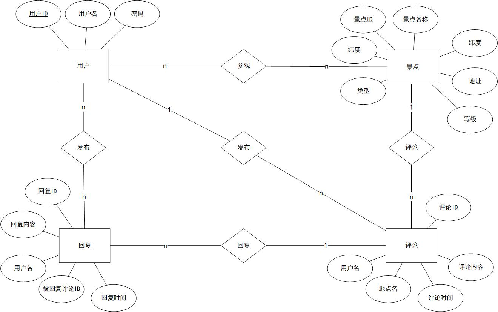{width="5.858507217847769in"
height="4.629835958005249in"}

用户具有ID、用户名、密码三个数据项；

景点具有ID、名称、类型、等级、地址、经度、纬度六个数据项；

评论具有ID、内容、用户名、地点名、评论时间五个数据项、

回复具有ID、用户名、被回复评论ID、内容、回复时间五个数据项。

### 5.1.6 数据组织

基于WebGIS的四川省旅游资源服务系统涉及两大类数据，即空间数据与业务数据。根据该系统的具体应用，分别对这两类数据进行组织和设计，数据之间的关联如图所示。

{width="5.396594488188977in"
height="3.6574070428696412in"}

1.  空间数据

空间数据是指与地理空间相关的数据，包括地理坐标、地图投影、地形地貌、道路交通等信息。在四川省旅游资源服务系统中，空间数据主要用于以下方面：

a)  景点位置信息的采集和管理：通过GPS、遥感等技术获取景点的位置信息，并将其存储在数据库中，方便后续查询和分析。

b)  地图制作和展示：将空间数据转换为可视化的地图形式，方便用户直观地了解景点分布情况、路线规划等信息。

c)  空间分析和规划：利用GIS技术对空间数据进行分析和规划，例如计算多个景点之间的距离、生成多景区最佳自驾路径规划图等。

为了实现这些功能，空间数据需要按照一定的格式和标准进行组织和设计，例如采用WGS84坐标系、EPSG编码等方式。同时，还需要建立空间数据的关联关系，例如景点之间的连通性、道路与景点的关系等。

2.  业务数据

业务数据是指与旅游资源服务相关的数据，包括景点介绍、门票价格、酒店预订等信息。在四川省旅游资源服务系统中，业务数据主要用于以下方面：

a)  景点信息管理：收集和整理景点的各种信息，例如名称、介绍、开放时间、门票价格等，并将其存储在数据库中。

b)  业务流程管理：建立业务流程管理系统，为用户提供快速访问景区、旅行社和酒店的接口，实现景点门票销售、酒店预订等功能。

c)  数据分析和报告：利用业务数据进行分析和报告，例如基于协同过滤算法分析游客偏好进行景点推荐等。

d)  评论信息管理：利用四川省旅游评价系统中的评论信息，分析景点和旅行社的运行情况，并基于此为下一步的规划决策提供参考。

为了实现这些功能，业务数据需要按照一定的格式和标准进行组织和设计，例如采用XML格式、JSON格式等方式。同时，还需要建立业务数据的关联关系，例如景点与酒店之间的关系、门票与景点之间的关系等。

## 5.2 物理结构设计要点

（1）旅游资源综合统计数据库：

  -------------------------------------------------------------------------------------------------------------------------------------------------------------------------
    数据目名称                                                                     旅游资源综合统计数据库
  -------------- ----------------------------------------------------------------------------------------------------------------------------------------------------------
     存储要求                      以SQL Server2008的数据格式MDF进行存储,要求设定存储的MDF文件自动增长而增长没有限制, 要求数据文件所在磁盘的空间在1G以上

     访问方法                                                                         通过ADO进行访问

     存取单位                                                                               字节

   存取物理关系                                                     通过各个表的主键和外键索引访问服务器磁盘中的MDF文件.

     设计考虑                                                       景区的指标完整,数据项的类型,长度等符合统计数据的要求

     保密设计     在访问方式上通过ADO进行访问不直接操作源数据.同时数据库的用户设计上分为三类(数据管理员,数据编辑人员,数据浏览人员),不同的访问者的权限不同,避免非法访问操作
  -------------------------------------------------------------------------------------------------------------------------------------------------------------------------

  : 表 13 旅游资源综合统计数据库

（2）旅游评价数据库：

  -------------------------------------------------------------------------------------------------------------------------------------------------------------------------
    数据目名称                                                                         旅游评价数据库
  -------------- ----------------------------------------------------------------------------------------------------------------------------------------------------------
     存储要求                      以SQL Server2008的数据格式MDF进行存储,要求设定存储的MDF文件自动增长而增长没有限制, 要求数据文件所在磁盘的空间在1G以上

     访问方法                                                                         通过ADO进行访问

     存取单位                                                                               字节

   存取物理关系                                                     通过各个表的主键和外键索引访问服务器磁盘中的MDF文件.

     设计考虑                                                               评价内容的长度、评价地点表述的唯一性

     保密设计     在访问方式上通过ADO进行访问不直接操作源数据.同时数据库的用户设计上分为三类(数据管理员,数据编辑人员,数据浏览人员),不同的访问者的权限不同,避免非法访问操作
  -------------------------------------------------------------------------------------------------------------------------------------------------------------------------

  : 表 14 旅游资源综合统计数据库

## 5.3 数据结构与程序的关系

基于WebGIS的四川省旅游资源服务系统各模块程序与数据结构之间的关系：

说明: A表示通过SuperMapSDX+进行访问,B表示通过ADO进行访问

<table>
<caption>
表 15 模块程序与数据关系表
</caption>
<colgroup>
<col style="width: 9%" />
<col style="width: 9%" />
<col style="width: 9%" />
<col style="width: 9%" />
<col style="width: 9%" />
<col style="width: 9%" />
<col style="width: 9%" />
<col style="width: 9%" />
<col style="width: 9%" />
<col style="width: 9%" />
<col style="width: 9%" />
</colgroup>
<thead>
<tr>
<th style="text-align: center;"></th>
<th style="text-align: center;">
模块

M1
</th>
<th style="text-align: center;">
模块

M2
</th>
<th style="text-align: center;">
模块

M3
</th>
<th style="text-align: center;">
模块

M4
</th>
<th style="text-align: center;">
模块

M5
</th>
<th style="text-align: center;">
模块

M6
</th>
<th style="text-align: center;">
模块

M7
</th>
<th style="text-align: center;">
模块

M8
</th>
<th style="text-align: center;">
模块

M9
</th>
<th style="text-align: center;">
模块

M10
</th>
</tr>
</thead>
<tbody>
<tr>
<td style="text-align: center;">旅游资源综合统计数据库</td>
<td style="text-align: center;"></td>
<td style="text-align: center;">A</td>
<td style="text-align: center;">A,B</td>
<td style="text-align: center;">A</td>
<td style="text-align: center;">A,B</td>
<td style="text-align: center;">A</td>
<td style="text-align: center;">A</td>
<td style="text-align: center;">A</td>
<td style="text-align: center;">A</td>
<td style="text-align: center;">B</td>
</tr>
<tr>
<td style="text-align: center;">旅游评价数据库</td>
<td style="text-align: center;">B</td>
<td style="text-align: center;"></td>
<td style="text-align: center;"></td>
<td style="text-align: center;">B</td>
<td style="text-align: center;"></td>
<td style="text-align: center;">B</td>
<td style="text-align: center;">B</td>
<td style="text-align: center;"></td>
<td style="text-align: center;"></td>
<td style="text-align: center;">B</td>
</tr>
</tbody>
</table>

# 6. 系统出错处理设计

## 6.1 出错信息

  -----------------------------------------------------------------------------------------------------------------------------------------------------------
    出错或故障情况    系统输出信息的形式                    含意                                                    处理方法
  ------------------ -------------------- ---------------------------------------- --------------------------------------------------------------------------
       硬件故障              蓝屏                         内存不足                                              重启计算机或系统

       通讯故障              404                        服务器未连接                                             等待服务器连接

     数据源不可用          错误消息               数据源无法连接或获取数据                    检查数据源连接和配置，尝试重新连接或切换到备用数据源

    无相关资源信息         提示消息          没有找到符合搜索条件的相关资源信息                     提供建议的搜索条件或提示用户更改搜索条件

     路径规划失败          错误消息              无法计算最佳路径或导航指引         重新尝试路径规划，确保起点和终点的准确性；提供备选路径或提供其他导航选项

    天气数据不可用         提示消息              无法获取指定地点的天气信息                      检查天气数据源连接和配置，尝试重新获取天气数据

    用户评论被拒绝         提示消息        用户的评论被系统认为不合适或违反了规定       解释拒绝原因并提醒用户遵守评论规定；提供途径以联系客服或提供反馈

      系统维护中           提示消息          系统正在进行维护，暂时无法提供服务                    提示用户稍后再试，或提供预计维护完成的时间

     用户请求超时          错误消息          用户的请求在预定时间内没有得到响应                     提示用户检查网络连接，并尝试重新发送请求

   无法连接到服务器        错误消息              用户的设备无法连接到服务器               检查网络连接，确保设备具有适当的网络连接；尝试重新连接服务器

     用户认证失败          错误消息                  用户的身份验证失败                提示用户检查用户名和密码，尝试重新登录；提供密码重置选项或联系客服
  -----------------------------------------------------------------------------------------------------------------------------------------------------------

  : 表 16 出错信息

## 6.2 补救措施

用户在操作系统的过程中会遇到一些无法预知的错误，例如：网站受到恶意攻击，造成服务器崩溃。因此，网站的日常维护是安全高效运行网站的不可缺少的一环，对于一些不可预知的问题，作为网站开发者需要及时的向用户发布通告，尽全力减少用户的损失。

采用SQL
Server2008的数据库维护计划功能,每隔两周对系统的数据库进行自动备份到指定的备份服务器,如果系统原始数据遭破坏,可以通过SQL
Server2008还原最近日期的数据,避免大的损失。

（1）当系统出现故障问题的时候,将系统用到工作空间进行共享,可以用SuperMap
Desktop来暂时进行系统数据的维护操作；

（2）当软件发生故障后,可以通过重新启动服务器的方法来进行恢复运行,同时系统对数据特别是空间数据的操作将采用事务机制,保证在数据操作过程中发生故障不影响到数据。

## 6.3 系统维护设计

### *6.3.1 检测点*

在程序中设立检测点，用于监控系统的运行状态和各个关键组件的健康状况。这些检测点可以包括：

（1）数据库连接检测：定期检测数据库连接是否正常，以确保系统能够正常访问和操作数据库。

（2）服务状态检测：监测关键服务的运行状态，如Web服务、数据服务等，以确保它们正常运行并响应用户请求。

（3）资源利用率检测：监测系统的资源利用率，如CPU、内存、磁盘空间等，以及其他性能指标，以便及时发现潜在的资源瓶颈或异常情况。

### 6.3.2 专用模块

设计专用模块用于系统的检查与维护，这些模块可以包括以下功能：

（1）日志记录与分析：设计日志模块记录系统的运行日志，包括错误日志、事件日志和用户操作日志等，以便后续故障排查和性能分析。

（2）数据备份与恢复：设计数据备份模块用于定期备份系统数据，并提供数据恢复功能，以确保数据的安全性和完整性。

（3）定时任务与计划：设计定时任务模块，用于定期执行系统的维护任务，如数据清理、索引重建、缓存刷新等，以确保系统的稳定性和性能优化。

成员分工情况

+---------+-------------------------------------------------------------------------------------------------------------------------+
| 成员    | 分工                                                                                                                    |
+:=======:+=========================================================================================================================+
| 1       | - 作为组长，确定主题，统筹工作                                                                                          |
|         |                                                                                                                         |
|         | - 需求分析、总体设计中主要负责功能划分与设计                                                                            |
|         |                                                                                                                         |
|         | - 登录注册页面前后端开发                                                                                                |
|         |                                                                                                                         |
|         | - 地图数据处理、服务发布、功能调用                                                                                      |
|         |                                                                                                                         |
|         | - 各类查询和路径规划、地图打印、地图可视化等主要功能                                                                    |
|         |                                                                                                                         |
|         | - 整合各成员开发系统                                                                                                    |
+---------+-------------------------------------------------------------------------------------------------------------------------+
| 2       | - 同小组成员讨论确定主题。                                                                                              |
|         |                                                                                                                         |
|         | - 在需求分析报告、总体设计报告中负责系统建模、部分文档的编写以及最后的报告校对排版。                                    |
|         |                                                                                                                         |
|         | - GIS数据的初步处理；                                                                                                   |
|         |                                                                                                                         |
|         | - 业务数据库的建立；                                                                                                    |
|         |                                                                                                                         |
|         | - 系统可视化大屏功能的设计与开发；                                                                                      |
|         |                                                                                                                         |
|         | - 系统市级区域查询功能的设计与开发；                                                                                    |
|         |                                                                                                                         |
|         | - 系统评价功能的设计与开发；                                                                                            |
|         |                                                                                                                         |
|         | - 通过IIS和NAT穿越技术的评论功能系统发布。                                                                              |
+---------+-------------------------------------------------------------------------------------------------------------------------+
| 3       | - 在老师和组长指导下，同小组成员讨论确定系统主题；                                                                      |
|         |                                                                                                                         |
|         | - 系统设计阶段，查阅资料，负责撰写需求分析报告中GIS项目、数据字典、GIS性能需求、质量保证、其他需求以及部分UML图的制作； |
|         |                                                                                                                         |
|         | - 系统开发阶段，距离查询，面积查询功能的开发；                                                                          |
|         |                                                                                                                         |
|         | - VR全景图的实现；                                                                                                      |
|         |                                                                                                                         |
|         | - 四川省十大热门景点地图的实现；                                                                                        |
|         |                                                                                                                         |
|         | - 总体设计报告中，负责撰写总体设计、接口设计、运行设计、系统出错处理设计以及部分UML图的制作等。                         |
+---------+-------------------------------------------------------------------------------------------------------------------------+
| 4       | - GIS数据处理，地图展点，网络数据集构建                                                                                 |
|         |                                                                                                                         |
|         | - 服务发布探索和实现                                                                                                    |
|         |                                                                                                                         |
|         | - 天气功能探索和开发                                                                                                    |
|         |                                                                                                                         |
|         | - 搜索功能探索和开发                                                                                                    |
|         |                                                                                                                         |
|         | - 地图符号数据处理                                                                                                      |
|         |                                                                                                                         |
|         | - 用户管理后端探索和开发                                                                                                |
|         |                                                                                                                         |
|         | - 四姑娘山登山路线                                                                                                      |
|         |                                                                                                                         |
|         | - 洪水淹没分析                                                                                                          |
+---------+-------------------------------------------------------------------------------------------------------------------------+

**目录**

目录

[SuperMap杯第二十一届高校GIS大赛 [1](#_Toc24496)](#_Toc24496)

[1 系统环境准备 [3](#系统环境准备)](#系统环境准备)

[1.1GIS服务器准备 [3](#gis服务器准备)](#gis服务器准备)

[1.2前端环境准备 [3](#前端环境准备)](#前端环境准备)

[1.3后端环境准备 [3](#后端环境准备)](#后端环境准备)

[1.3.1 Java环境 [3](#java环境)](#java环境)

[1.3.2 Maven环境 [4](#maven环境)](#maven环境)

[1.4数据库环境准备 [4](#数据库环境准备)](#数据库环境准备)

[2 系统部署 [4](#系统部署)](#系统部署)

[2.1 GIS服务部署 [4](#gis服务部署)](#gis服务部署)

[2.2 前端部署 [6](#前端部署)](#前端部署)

[2.3 后端部署 [6](#后端部署)](#后端部署)

[2.4 数据库 [7](#数据库-1)](#数据库-1)

[2.5 评价功能部署 [7](#评价功能部署)](#评价功能部署)

**\**

# 1 系统环境准备

## 1.1GIS服务器准备

安装SuperMap iServer，并取得相应许可。

## 1.2前端环境准备

安装NodeJS18（<https://nodejs.org/en>）

{width="4.160416666666666in"
height="2.017361111111111in"}

安装完成后使用命令

> node -v
>
> npm -v

来查看node和npm的版本，若成功出现则说明安装成功。

## 1.3后端环境准备

### 1.3.1 Java环境

安装Java1.8（<https://www.oracle.com/java/technologies/downloads/#java8>）

{width="3.915277777777778in"
height="1.9430555555555555in"}

安装完成后使用

> java \--version

查看Java版本，若成功出现则说明安装成功；若出现未找到情况，则需要配置系统环境变量（<https://blog.csdn.net/weixin_42182599/article/details/107370719>）。

### 1.3.2 Maven环境

推荐安装IDEA作为IDE，该软件自带Maven环境。当然我们推荐安装自己的Maven环境，并且更换为阿里云的镜像源，帮助我们更快地下载依赖。

Maven下载：<https://maven.apache.org/>

Maven镜像源更换教程[将maven换源成国内源_是庸庸的博客-CSDN博客](https://blog.csdn.net/weixin_45225492/article/details/131703448)

## 1.4数据库环境准备

需要安装MySQL数据库（[MySQL :: MySQL
Downloads](https://www.mysql.com/downloads/)），并开放默认的3306端口。

# 2 系统部署

## 2.1 GIS服务部署

使用iServer选择提交成果中的成果数据的地图数据中的smwu，不设置工作空间密码

{width="5.490277777777778in"
height="2.671527777777778in"}

选择REST类型的地图、数据和交通网络分析服务

{width="5.386111111111111in"
height="2.609027777777778in"}

地图服务配置如下，允许编辑

{width="5.763888888888889in"
height="0.9159722222222222in"}

数据服务配置如下，允许编辑和发布所有数据集

{width="5.759722222222222in"
height="3.297222222222222in"}

交通网络分析服务配置，填佳权值字段，权值信息的名称为Length

{width="5.766666666666667in"
height="3.54375in"}

结果为transportationAnalyst-SiChuan/rest、data-SiChuan/rest、map-SiChuan/rest服务发布完成。

## 2.2 前端部署

首先进入系统源程序code目录下，将整个文件拖入IDEA打开

新建控制台，输入

cd fronted

cd tf

进入了前端项目的路径，接下来使用命令

npm install

等待依赖安装完毕，必要时可更换npm的镜像库以提升依赖下载速度。

以上全部完成后，使用命令

npm run serve

启动前端项目，使用localhost:8080即可进入系统

{width="5.763194444444444in"
height="2.808333333333333in"}

默认管理员账号密码： admin 123

## 2.3 后端部署

首先配置IDEA Java版本为1.8，Maven选择换源后的本地Maven

进入pom.xml文件，点击右上角的Maven刷新按钮

等待依赖下载完毕

随后进入src-resources-application.yml修改为自己本地的数据库名称和密码

{width="5.759027777777778in"
height="2.6319444444444446in"}

点击软件上部运行按钮运行即可启动后端项目，默认端口为9090

## 2.4 数据库

数据库使用MySQL，在数据库管理软件如Navicat中运行我们提供的源代码中的sql文件，建立出名为tianfu的数据库则数据库搭建成功。

## 2.5 评价功能部署

为便于其他访客顺利使用评价功能，我们将评价功能部分先发布至本地IIS服务器，后通过NAT穿越技术将其发布到公网上，从而使访客只需要一串网址就可以访问评论功能（网址为：[http://traveladv.natapp1.cc](http://traveladv.natapp1.cc/)）。大致步骤如下：（如需评测评价功能，可联系13034547750开启服务器）。

**目录**

[0 系统概述 [3](#系统概述)](#系统概述)

[1 登录界面 [3](#登录界面)](#登录界面)

[1.1 宣传页 [3](#宣传页)](#宣传页)

[1.2 登录页面 [4](#登录页面)](#登录页面)

[2 系统功能使用 [5](#系统功能使用)](#系统功能使用)

[2.1 基础GIS操作 [5](#基础gis操作)](#基础gis操作)

[2.1.1 放大、缩小、移动 [5](#放大缩小移动)](#放大缩小移动)

[2.1.2 绘制多边形、添加标记
[6](#绘制多边形添加标记)](#绘制多边形添加标记)

[2.1.3 地图打印 [6](#地图打印)](#地图打印)

[2.1.4 距离量算和面积量算 [6](#距离量算和面积量算)](#距离量算和面积量算)

[2.2 天气功能 [7](#天气功能)](#天气功能)

[2.2.1 快速天气查询 [7](#快速天气查询)](#快速天气查询)

[2.2.2 详细天气查询 [7](#详细天气查询)](#详细天气查询)

[2.3 查询功能 [8](#查询功能)](#查询功能)

[2.3.1 属性查询 [8](#属性查询)](#属性查询)

[2.3.2 范围查询 [8](#范围查询)](#范围查询)

[2.3.3 分区查询 [8](#分区查询)](#分区查询)

[2.3.4 市级区域可视化功能 [9](#市级区域可视化功能)](#市级区域可视化功能)

[2.4 大屏 [10](#大屏)](#大屏)

[2.5 评价功能 [12](#评价功能)](#评价功能)

[2.6 路径查询功能 [13](#路径查询功能)](#路径查询功能)

[2.7 全景地图功能 [13](#全景地图功能)](#全景地图功能)

[2.8 景点推荐功能 [14](#景点推荐功能)](#景点推荐功能)

**\**

# 0 系统概述

基于WebGIS的四川省旅游资源服务系统的结构与功能从总体结构和功能分配方面统一考虑,系统的数据库及软件模块将可以在其它子系统中进行重用，以减少今后系统开发和维护的工作量。

按照功能构成，软件系统可分为七个主要部分：用户管理功能、地图浏览功能、地图可视化功能、地图查询功能、地图分析功能、景区评价功能和拓展功能。其功能结构图如图所示。

{width="5.763194444444444in"
height="4.358333333333333in"}

# 1 登录界面

## 1.1 宣传页

进入系统后首先展示的页面，作为系统的根页面，使用户能对系统的情况、功能、设计理念、开发者有一个快速的认识。此页面设计了菜单、轮播图、旅游路线和门票详情，采用卡片格式。

{width="5.75in"
height="3.05in"}

+--------------------------------------------------------------+--------------------------------------------------------------+
| {width="2.8679713473315838in" | {width="2.6330544619422573in" |
| height="1.7287773403324584in"}                               | height="1.569012467191601in"}                                |
|                                                              |                                                              |
| 图 3 介绍卡片                                                | 图 4 旅游路线                                                |
+:============================================================:+:============================================================:+
| {width="2.7644663167104113in" | {width="2.7459744094488188in" |
| height="1.6361122047244094in"}                               | height="1.608753280839895in"}                                |
|                                                              |                                                              |
| 图 5 功能介绍                                                | 图 6 成员介绍                                                |
+--------------------------------------------------------------+--------------------------------------------------------------+

## 1.2 登录页面

在首页中点击右上角的登录按钮即可进入登录界面，可以使用已有的用户名和密码登录，也可以注册新的用户后登录。默认的管理员账号密码为：admin
123

{width="4.355634295713036in"
height="2.549892825896763in"}

# 2 系统功能使用

## 2.1 基础GIS操作

系统支持放大、缩小、移动、距离量算和面积量算等基础地图操作，也支持在地图上绘制多边形、添加标记，同时提供打印地图功能，可将地图中的内容保存为图片。

{width="5.588498468941382in"
height="2.7710345581802276in"}

### 2.1.1 放大、缩小、移动

鼠标移动到地图上，滚动鼠标滚轮即可放大或者缩小地图，在地图上按住鼠标左键，然后拖动鼠标，即可移动地图。

### 2.1.2 绘制多边形、添加标记

在地图的左侧，有一列工具栏，提供了强大的地图绘制工具，支持点、线、圆形、矩形、多边形等多种要素的绘制。

### 2.1.3 地图打印

点击导航栏上的地图打印按钮即可打印地图中的内容为图片，包括用户绘制的矢量和标记。

### 2.1.4 距离量算和面积量算

点击左侧的距离量算按钮，进入绘制状态，在地图上绘制线段，即可量算出线段的长度，结果以弹窗形式显示在地图右上角。面积量算操作方式相同。

{width="5.257478127734033in"
height="2.6068974190726157in"}

{width="5.6840452755905515in"
height="2.818410979877515in"}

## 2.2 天气功能

系统支持基于和风天气的实时天气查询。

### 2.2.1 快速天气查询

点击地图上任意位置，即可在界面右上角看到该位置的实时天气信息。

{width="5.581211723534558in"
height="2.7674201662292215in"}

### 2.2.2 详细天气查询

在左侧的天气查询功能块中输入目标城市名称，点击查询即可获取目标城市的详细天气信息。

{width="5.767361111111111in"
height="2.859722222222222in"}

## 2.3 查询功能

### 2.3.1 属性查询

从搜索栏获取查询地点，向iServer服务器查询服务发送模糊查询请求，将得到的结果以json形式加载至地图上。

{width="4.609934383202099in"
height="2.294699256342957in"}

### 2.3.2 范围查询

使用标绘控件获取范围，向iServer服务器查询服务发送范围查询请求，将得到的查询类型地图以json形式加载至地图上。

{width="4.699124015748032in"
height="2.339093394575678in"}

### 2.3.3 分区查询

判断鼠标点击的位置，将这个坐标与市区域做相交，得到相交市信息，随后用市做旅行社SQL查询，即可得到该市内所有旅行社的信息。

{width="5.299899387576553in"
height="2.6381430446194227in"}

### 2.3.4 市级区域可视化功能

根据比赛要求"选择合适的可视化展示方法，在地图中展示四川省A级景区的分布情况；在地图中清晰表达四川省各市5A、4A、3A级旅游景区数量。以及在地图上点击市级行政区划，展示该市内的旅行社信息。"这里采用开源库Echarts.js进行上述功能的实现。

#### 2.3.4.1 区域查询

在该界面中，当鼠标指针移动到地图上的市级区域时，就会弹出该市的5/4/3A级景区数量，该数据以JSON格式存储。此外，点击左侧的按钮可以选择不同景区等级进行跳转；对于旅行社信息，即可以在任意界面点击左下侧的市级按钮，也可以在旅行社地图上，点击相应市级区域查看该市所有旅行社信息，旅行社信息以PDF格式存储。

{width="4.883113517060368in"
height="2.361586832895888in"}

{width="5.697264873140857in"
height="2.7247779965004373in"}

#### 2.3.4.2 地图下钻

在上述市级区域查询的基础上，进一步细化到县级区域查询，当访客点击地图上的某一市级区域后，地图就会变化为该市的县级划分地图，并且在鼠标指针划过县级区域时，就会弹出该县的5/4/3A级景区数量。当点击该县地图时，地图就会变回原始的四川省地图。

{width="5.089757217847769in"
height="2.821035651793526in"}

## 2.4 大屏

利用Supermap Online平台，数据由SuperMap
iDeaktop处理。基于前期获得的点位数据完成数据分析和数据可视化，从而使数据更直观。其中在大屏中点击地图可以直接显示此地点的各项信息，同时地图与其左侧的滚动表格也具有联动功能。

{width="5.60101268591426in"
height="2.7880293088363954in"}

{width="5.503206474190726in"
height="2.997736220472441in"}

{width="5.430475721784777in"
height="2.8061603237095363in"}

## 2.5 评价功能

评价功能包括三个界面：评价界面、登录界面、管理员界面。

评价界面可以让访客进行留言，并将评价信息包括评价地点（景点/旅行社）评价内容、用户名、评价时间存入数据库表。

{width="6.110352143482065in"
height="3.261634951881015in"}

登陆界面需要输入用户名和密码，包含在数据库中的gly1表中（管理员密码为admin，密码为1）。

{width="5.761805555555555in"
height="3.058333333333333in"}

管理员界面可以实现对用户评价进行回复功能，并将回复内容存储在数据库表中，并且可以对评价进行删除和回复。

{width="5.767361111111111in"
height="2.803472222222222in"}

## 2.6 路径查询功能

系统基于iServer发布的交通网络分析服务支持路径查询功能，用户可以选择在地图上点击或者选择景区两种方式添加站点，站点添加完毕后，点击规划按钮即可规划最佳路线。

{width="5.767361111111111in"
height="3.058333333333333in"}

## 2.7 全景地图功能

用户可以在系统的VR全景图展示中选择感兴趣的四川省景区，点击即可查看兴趣景点全景图，可拖动滑轮左右旋转视角和放大缩小，为用户提供更多景区视觉和景观。

{width="5.759722222222222in"
height="3.4583333333333335in"}

## 2.8 景点推荐功能

利用MapBox
GL和Vue控件构建幻灯片地图，在切换幻灯片时改变地图视角，展示了四川省十大热门景点的详细信息。

{width="5.767361111111111in"
height="2.870833333333333in"}

{width="5.759722222222222in"
height="2.8201388888888888in"}
